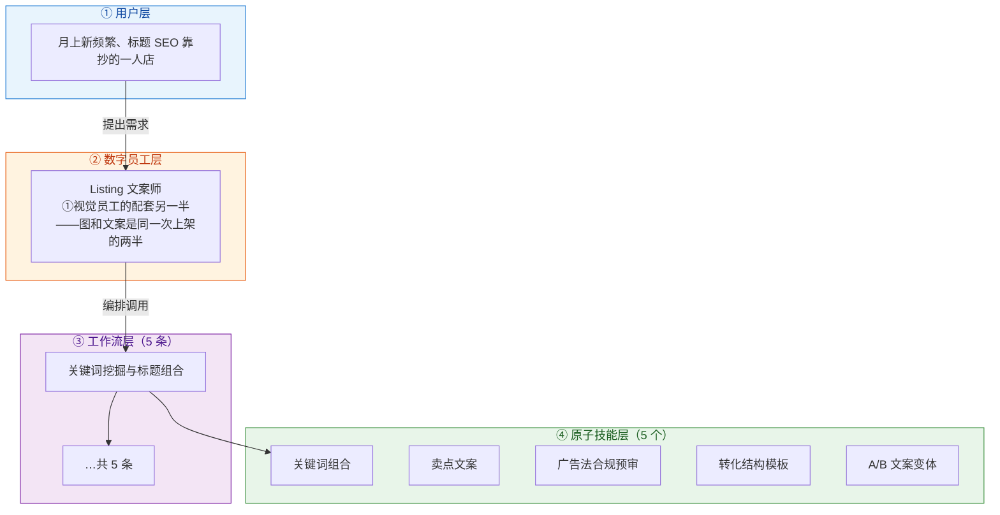
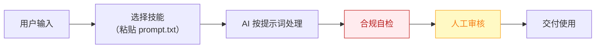

# Listing 文案师 — 业务架构

## 四层视图

## 资产形态说明

本资产包为**纯提示词客户端资产**：

| 特性 | 说明 |
|------|------|
| 无运行时依赖 | 不调用任何模型 API，不需要 API Key |
| 平台无关 | 提示词为纯文本，可导入任意主流 AI 平台 |
| 用户自备算力 | 模型由用户自己的订阅提供 |
| 零服务端成本 | 资产方不产生任何调用费用 |

## 数据流

> **关键设计**：所有对外输出必须经过「合规自检 → 人工审核」双闸门。

## 能力边界

| 维度 | 内容 |
|------|------|
| **目标用户** | 月上新频繁、标题 SEO 靠抄的一人店 |
| **做** | 标题组合、卖点、详情页文案、合规扫描 |
| **不做** | 不做：虚假功效宣称、极限词擦边 |
| **KPI** | 标题生成→上架 ≤10 分钟；合规扫描覆盖率 100%；CTR 环比提升 |
| **定价** | 30-80 元/月（单独卖偏弱，建议与①捆绑） |

---

*本图由 build_p0_assets.py 自动生成*
