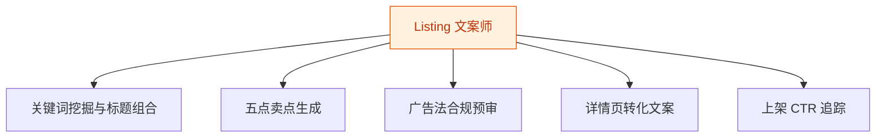
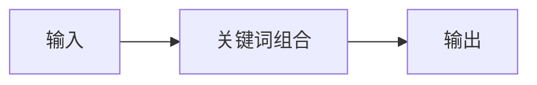
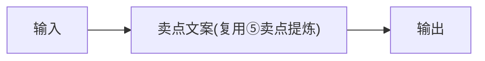
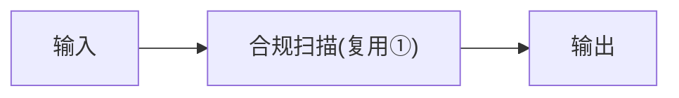
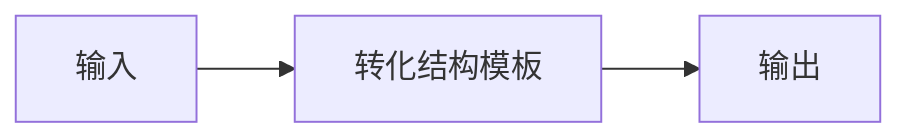
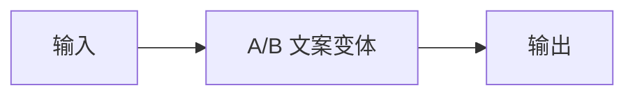

# Listing 文案师 — 工作流流程图

本员工共 **5 条工作流**，下辖 **5 个原子技能**。

## 总览

## 分条详情

### 关键词挖掘与标题组合

| 项目 | 内容 |
|------|------|
| 触发 | 人工 |
| 复杂度 | `S` |
| 阶段 | `P0` |
| ROI | 月省文案 10h≈¥300 |

### 五点卖点生成

| 项目 | 内容 |
|------|------|
| 触发 | 人工 |
| 复杂度 | `S` |
| 阶段 | `P0` |
| ROI | 与①同场景触发，零额外流程 |

### 广告法合规预审

| 项目 | 内容 |
|------|------|
| 触发 | 事件（文案定稿） |
| 复杂度 | `S` |
| 阶段 | `P0` |
| ROI | 一次违规处罚即超全年订阅费 |

### 详情页转化文案

| 项目 | 内容 |
|------|------|
| 触发 | 人工 |
| 复杂度 | `S` |
| 阶段 | `P1` |
| ROI | 替代详情页文案外包 |

### 上架 CTR 追踪

| 项目 | 内容 |
|------|------|
| 触发 | 定时（每周） |
| 复杂度 | `S` |
| 阶段 | `P2` |
| ROI | 标题迭代从凭感觉变看数据 |

## 汇总表

| # | 工作流 | 阶段 | 复杂度 | 触发 | 涉及技能数 |
|---|--------|------|--------|------|-----------|
| 1 | 关键词挖掘与标题组合 | `P0` | `S` | 人工 | 1 |
| 2 | 五点卖点生成 | `P0` | `S` | 人工 | 1 |
| 3 | 广告法合规预审 | `P0` | `S` | 事件（文案定稿） | 1 |
| 4 | 详情页转化文案 | `P1` | `S` | 人工 | 1 |
| 5 | 上架 CTR 追踪 | `P2` | `S` | 定时（每周） | 1 |

---

*本图由 build_p0_assets.py 自动生成*
