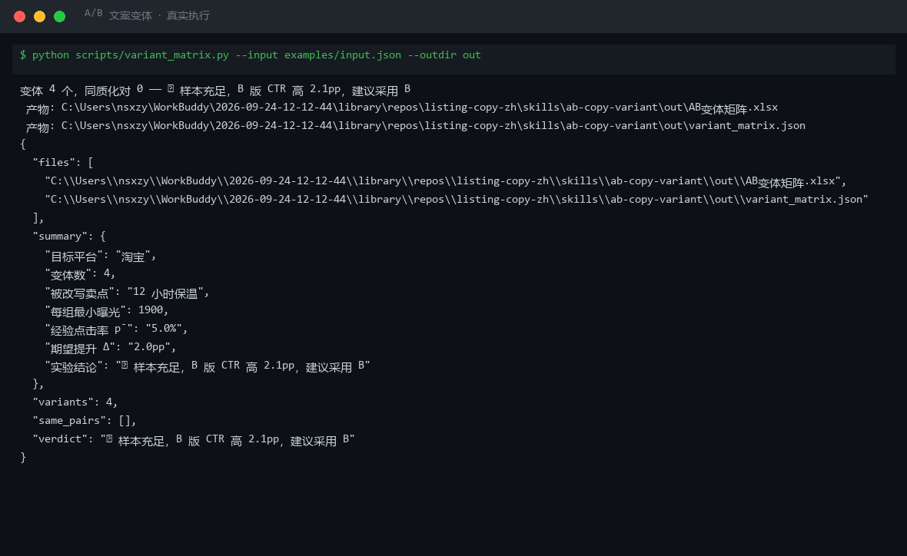
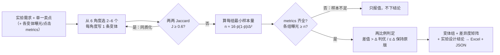

# A/B 文案变体 A/B Copy Variant

> 原子技能 ｜ 属于「Listing 文案师」 ｜ 电商小卖家客群 ｜ T2 提示词 + 确定性校验脚本（ID `de_ecom_07_sk05`）
>
> **把同一个卖点从不同说服角度改写成 2–6 个真正不同的变体——不同质、单一变量、可做显著性检验——并给出 CTR 数据下的择优建议。**
> 6 个标准角度库 · Jaccard 差异度三档判定（≥ 0.6 判同质化）· 样本量公式 `n ≈ 16·p̄(1-p̄)/Δ²` · 4 档结论口径（只报值 / 可判优 / 无差异 / 流量异常）



*上图来自真实执行：淘宝保温杯 4 变体 A/B 实验实跑判定——两两 Jaccard ≤ 0.03 差异充分，B 版 CTR 7.18% 高 2.10pp > 阈值 2.0pp，判「建议采用 B」，产物落盘 Excel + JSON。*

---

## 它做什么（角度库 + 差异度 + 样本量纪律）

### 一、6 个标准角度（同一角度最多 1 个变体）

| 角度 | 说服路径 | 示例（保温杯「12 小时保温」） |
|---|---|---|
| 理性功能 | 陈述参数与机制 | 304 不锈钢 + 真空层，12 小时保温 |
| 数据实证 | 用可核验数字支撑 | 实测 500ml 热水 12 小时后 ≥ 55℃（样本 3 次） |
| 场景代入 | 放进具体使用情境 | 早上灌的热水，开完下午的会还是温的 |
| 情感共鸣 | 呼应情绪与身份 | 忙到忘了喝水的人，更需要一杯温的 |
| 疑问钩子 | 用问题制造停顿 | 你的保温杯，真的能撑一个工作日吗？ |
| 对比反差 | 与旧方案/常规认知对比 | 不是所有保温杯都能扛住 8 小时会议 |

### 二、变体差异度（Jaccard，防同质化）

`J(A,B) = |A ∩ B| / |A ∪ B|`（按词元集合计算）

| J 值 | 判定 | 处理 |
|---|---|---|
| J ≥ 0.6 | 🔴 同质化 | 重写，换角度（同义换词让 A/B 白跑） |
| 0.3 ≤ J < 0.6 | 🟡 偏相似 | 建议再拉开 |
| J < 0.3 | ✅ 差异充分 | 可用于实验 |

### 三、单一变量 + 样本量纪律（决定结论敢不敢下）

- **单一变量**：只改卖点表达；价格 / 主图 / 时段 / 类目全部冻结，改了 ≥ 2 个变量判「实验无效」
- **每组最小样本量** `n ≈ 16 × p̄ × (1 - p̄) / Δ²`：p̄ = 5%、Δ = 2pp → **n ≈ 1900 次曝光/组**
- 任一组曝光 < n → ⚠️ 只报值不下结论；曝光严重不均（比值 > 3:1）→ 先排查流量分配

| 情况 | 结论 |
|---|---|
| 各组曝光 ≥ n 且 CTR 差值 > Δ | ✅ 可判优 |
| 各组曝光 ≥ n 但差值 ≤ Δ | ⚪ 无显著差异，保持原版 |
| 任一组曝光 < n | ⚠️ 样本不足，只报值不下结论 |

## 真实输入 → 真实输出

**输入**（`examples/input.json` 关键字段）：

```json
{
  "platform": "淘宝",
  "selling_point": "12 小时保温",
  "p_bar": 0.05, "delta": 0.02,
  "variants": [{"角度": "理性功能", "文案": "304不锈钢+真空层，12小时保温"}, {"角度": "场景代入", "文案": "早上灌的热水，开完下午的会还是温的"}, "…共 4 个"],
  "metrics": {"A": {"曝光": 2400, "点击": 132}, "B": {"曝光": 2450, "点击": 176}, "…": {}}
}
```

**输出**（脚本实跑，节选）：

| 变体 | 角度 | CTR | 相对最低者 |
|---|---|---|---|
| A | 理性功能 | 5.50% | — |
| **B** | **场景代入** | **7.18%** | **+2.10pp > Δ 2.0pp → 胜出** |
| C | 疑问钩子 | 5.08% | — |
| D | 情感共鸣 | 5.74% | — |

差异度矩阵：所有变体两两 J ≤ 0.03（全部 < 0.3，差异充分）；每组曝光均 ≥ 最小曝光 1900。完整矩阵见 [`examples/output.md`](examples/output.md)；Excel 产物：`out/AB变体矩阵.xlsx`。

## 处理流水线



## 快速开始

**方式一：提示词（任意 AI 工具）**

```text
1. 打开 prompt.txt，全文复制
2. 粘贴到 Coze / WorkBuddy / Dify / Claude / ChatGPT
3. 按 schema.json 的输入规格提供：brief + selling_point（有数据再加 metrics）
```

**方式二：脚本（零 AI 依赖，确定性计算）**

```bash
python scripts/variant_matrix.py --input examples/input.json --outdir out
```

## 该用 / 别用

| ✅ 该用 | ❌ 别用 |
|---|---|
| 标题 / 首条 bullet / 主图卖点的 A/B 实验设计 | 写新卖点（转卖点文案）、做合规终审（转广告法预审） |
| 已有变体校验差异度，剔除「同义换词」假变体 | 一次实验同时改价格、主图、时段等多个变量 |
| 有曝光/点击数据时做显著性判定与择优 | 样本不足仍下「A 版更好」的结论 |
| 跨平台字数约束校验（超限变体不进实验） | 编造 CTR、曝光量、转化率数据 |

## 边界与合规

- 本资产输出为 **AI 辅助生成内容**，上线实验前必须人工确认，并按平台要求完成 AI 内容标识
- 实验不得针对同一用户重复展示不同价格（平台差异化定价规则）
- 数据口径以平台后台为准，本技能不采集任何用户数据；行业经验值须标注「经验值」，不当实测数据引用

## 文件地图

```text
├── README.md                    ← 本文件
├── SKILL.md                     ← 资产定义（元信息 / 契约 / 边界）
├── prompt.txt                   ← 提示词本体（6 角度库 + Jaccard 口径 + 样本量公式）
├── schema.json                  ← 输入输出契约（机器可读）
├── scripts/variant_matrix.py    ← 确定性计算脚本（差异度/样本量/CTR → Excel/JSON）
├── examples/                    ← 真实输入 + 脚本实跑输出
├── docs/                        ← 10 项配套文档（架构 / 流程 / 场景 / 测试报告…）
└── out/                         ← 实跑产物（AB变体矩阵.xlsx / variant_matrix.json）
```

---

*本资产遵循 [bangwozuo 数字员工资产规范](https://github.com/bangwozuo/digital-employee-spec) v3.0 ｜ [所属员工：Listing 文案师](../../) ｜ [总入口](https://github.com/bangwozuo/digital-employees-hub-zh)*
