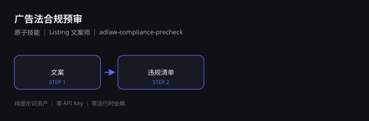

# 广告法合规预审

> 原子技能 ｜ 属于「Listing 文案师」 ｜ 电商小卖家 客群 ｜ ID `de_ecom_07_sk03`

在文案定稿后、上架前，把会被平台**驳回、限流、处罚**的表述挑出来，并给出**可直接替换的改法**。



---

## 这是什么

一份可直接粘贴到任意 AI 工具的提示词，外加一个**离线可跑的扫描脚本**（四类规则分级扫描 → Excel）。

| 特性 | 说明 |
|------|------|
| 零 API Key | 不需要任何密钥 |
| 零部署 | 无需服务端；脚本用本机 Python 直接跑 |
| 平台无关 | Coze / WorkBuddy / Dify / Claude / ChatGPT 均可 |
| 用户自备算力 | 模型来自你自己的订阅 |

## 快速开始

**方式一 · 纯提示词**

```text
1. 打开 skills/adlaw-compliance-precheck/prompt.txt
2. 全文复制，粘贴到你的 AI 工具
3. 提供 text + platform（可选 category）
```

**方式二 · 带脚本（产出 Excel 违规清单）**

```bash
python scripts/adlaw_scan.py --input examples/input.json --outdir out
```

产物：`out/广告法预审清单.xlsx`、`out/adlaw_scan.json`

## 四类规则

| 类 | 内容 | 依据 |
|---|---|---|
| 绝对化用语 | 最、第一、独家、国家级、100%… | 《广告法》第九条 |
| 类目禁用 | 化妆品/食品/保健品/医疗器械/母婴/教育/金融 | 条例与专门法 |
| 虚假与不正当竞争 | 虚假促销、好评返现、贬低竞品、未授权品牌词、专利虚标 | 《反不正当竞争法》第八/十一条、《广告法》第十二条 |
| 平台特有 | 站外导流、主图牛皮癣、资质公示 | 各平台内容规范 |

判定分三级：🔴 红线（必须改）/ 🟡 警告（建议改）/ 🔵 提示（需补材料）。

## 文件地图

```text
├── README.md                ← 本文件
├── SKILL.md                 ← 资产定义（元信息 / 契约 / 边界）
├── prompt.txt               ← 提示词本体（核心交付物）
├── schema.json              ← 输入输出契约（机器可读）
├── scripts/                 ← 离线扫描脚本（产出 Excel）
├── examples/                ← 示例输入与实跑输出
└── docs/                    ← 10 项配套文档
```

## 面向谁 / 解决什么

- **用户群体**：淘宝 / 抖店 / 拼多多 / 小红书店铺小卖家
- **解决痛点**：上架被驳、限流扣分、一次处罚超过全年工具成本
- **衡量指标**：上架一次通过率、违规下架次数

详见 [使用示例](docs/04-examples.md) 与 [测试报告](docs/09-test-report.md)。

## 合规

- 本资产输出为 **AI 辅助预审结果**，交付前必须经人工审核
- 不提供规避平台审核的写法；平台规则以官方公示为准
- 本预审**不构成法律意见**，请按平台要求完成 **AI 生成内容标识**

---

*本资产遵循 [bangwozuo 数字员工资产规范](https://github.com/bangwozuo/digital-employee-spec) v3.0*
