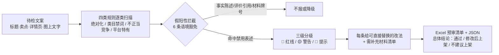

# 广告法合规预审 AdLaw Compliance Precheck

> 原子技能 ｜ 属于「Listing 文案师」 ｜ 电商小卖家客群 ｜ T2 提示词 + 确定性扫描脚本（ID `de_ecom_07_sk03`）
>
> **在文案定稿后、上架前，把会被平台驳回、限流、处罚的表述挑出来，并给出可直接替换的改法。**
> 四类规则逐类扫描（绝对化用语 / 7 类目禁用词 / 虚假与不正当竞争 / 平台特有）· 三级判定（🔴 红线 / 🟡 警告 / 🔵 提示）· 6 条假阳性拦截规则 · 依据 5 部法规与 4 个平台规范


🎬 **[▶ 观看高清完整版（mp4）](https://cdn.jsdelivr.net/gh/bangwozuo/listing-copy-zh@main/skills/adlaw-compliance-precheck/docs/assets/demo.mp4)** — 四幕检测叙事：业务钩子 → 真实执行 → 检查项逐条亮灯 → 交付物

*上图来自真实执行：122 字化妆品文案实跑扫描，命中 18 项（红线 14 / 警告 2 / 提示 2），判定「不建议上架」，产物落盘 Excel + JSON。*

---

## 它查什么（四类规则，逐类扫描）

### 一类：绝对化用语（《广告法》第九条，明文禁止）

| 子类 | 词族示例 | 改法 |
|---|---|---|
| 最高级 | 最、最佳、最低价、最便宜、最先进 | 改具体描述：「2026 年新款」「店铺热销」 |
| 排名 | 第一、销量第一、TOP1、冠军、领导者 | 删除；或改「店铺热销单品」并注明数据口径 |
| 唯一性 | 唯一、独家、首创、首款、空前绝后 | 有专利则写「已获专利 ZL…」（附号） |
| 级别 | 国家级、世界级、顶级、极品、至尊 | 删级别词，改客观参数 |
| 功效断言 | 100%、彻底、根治、永不、绝对安全、无任何副作用 | 改有条件表述：「实测反馈良好（样本 30 人）」 |

### 二类：类目特有禁用表述（按 `category` 启用，7 张禁词表）

| 类目 | 禁用表述示例 | 依据 |
|---|---|---|
| 化妆品 | 治疗、疗效、消炎、抗敏、药妆、医学级、祛斑 | 《化妆品监督管理条例》第 22 条 |
| 食品 | 降血压、降血糖、抗癌、排毒、防癌 | 《食品安全法》第 73 条 |
| 保健品 | 治愈、替代药物、无副作用、疗效 | 不得宣称疾病预防治疗功能 |
| 医疗器械 | 根治、痊愈、包治、无风险 | 需附注册证号 |
| 母婴 | 最安全、绝对安全、无添加（无报告） | 需检测报告支撑 |
| 教育 / 金融 | 保过、包就业 / 保本、稳赚、零风险 | 《广告法》第 24 / 25 条 |

### 三类：虚假与不正当竞争 + 四类：平台特有规则

- **虚假促销**：虚构原价、「仅此一天」长期挂（《禁止价格欺诈行为的规定》第六条）
- **诱导评价**：好评返现、晒图返款（《反不正当竞争法》第八条）——处罚概率最高的两类之一
- **贬低竞品 / 未授权品牌词 / 专利认证虚标**（第十一、十二条）
- **站外导流**：微信号、二维码、扫码进群（各平台均禁）；**主图牛皮癣**；**资质公示缺失**

### 三级判定 + 假阳性拦截（不误报）

| 级别 | 含义 | 处理 |
|---|---|---|
| 🔴 红线 | 法定禁止或平台明确驳回 | **必须改**，给替换写法 |
| 🟡 警告 | 高概率触发限流/扣分 | 给保守写法 |
| 🔵 提示 | 需补证明材料才可用 | 说明要什么材料 |

语境豁免：「最新款 iPhone 手机壳」属事实陈述不报；「第一眼就喜欢」属评价引用标 🟡；注册商标含禁用词标 🔵；「无添加」有检测报告只标 🔵 补报告编号；「316L 医用级不锈钢」指材料牌号不报。

## 真实输入 → 真实输出

**输入**（`examples/input.json`）：

```json
{
  "platform": "淘宝",
  "category": "化妆品",
  "text": "【全网最低价】医美级精华液，100%彻底淡化痘印，效果最好的抗敏修复神器！国家级实验室研发，独家配方，销量第一。好评返现 5 元，加微信 xxx 领试用装，扫码进群。…"
}
```

**输出**（脚本实跑，命中 18 项，节选）：

| # | 级别 | 违规词 | 命中规则 | 依据 | 修改建议 |
|---|---|---|---|---|---|
| 1 | 🔴 | 最低 | 绝对化·最高级 | 《广告法》第九条 | 改「限时优惠价 ¥99」 |
| 2 | 🔴 | 医美级 | 化妆品·医疗宣称 | 《化妆品监督管理条例》第 22 条 | 删医疗表述，改「舒缓」 |
| 10 | 🔴 | 好评返现 | 诱导评价 | 《反不正当竞争法》第八条 | 删返现话术 |
| 11 | 🔴 | 加微信 | 淘宝·站外导流 | 淘宝内容规范 | 删导流信息 |
| 16 | 🟡 | 专利配方 | 专利虚标 | 《广告法》第十二条 | 补专利号或删除 |
| 17 | 🔵 | 纯天然 | 无添加宣称 | 需检测报告支撑 | 补检测报告编号 |

完整 18 条见 [`examples/output.md`](examples/output.md)；Excel 产物：`out/广告法预审清单.xlsx`（总体判定 + 违规清单 + 需补充材料）。

## 处理流水线



## 快速开始

**方式一：提示词（任意 AI 工具）**

```text
1. 打开 prompt.txt，全文复制
2. 粘贴到 Coze / WorkBuddy / Dify / Claude / ChatGPT
3. 按 schema.json 的输入规格提供：text + platform（可选 category 启用类目禁词表）
```

**方式二：脚本（零 AI 依赖，确定性扫描）**

```bash
python scripts/adlaw_scan.py --input examples/input.json --outdir out
```

## 该用 / 别用

| ✅ 该用 | ❌ 别用 |
|---|---|
| 文案定稿后、上架前的最后一道合规检查 | 替代法律意见（规则以平台官方公示为准） |
| 批量 SKU 批量预筛（脚本模式，确定性词表扫描） | 100% 准确零人工（AI 预审必须人工复核） |
| 想知道某个表述「怎么改」而不是只被告知「不行」 | 提供谐音、拼音、拆字等规避平台审核的写法（违规协助，不做） |
| 需要每条判定引用原文片段、可逐条溯源 | 修改商品实质信息（价格、成分、规格的真实数值） |

## 边界与合规

- 本资产输出为 **AI 辅助预审结果**，不得作为最终合规依据，交付前必须人工审核并按平台要求完成 AI 内容标识
- 平台规则与法规口径可能更新，上架前请对照平台官方最新规范二次确认
- 不构成法律意见；不抓取登录态数据；涉及类目资质（食品/化妆品/医疗器械）须法务或平台确认

## 文件地图

```text
├── README.md                  ← 本文件
├── SKILL.md                   ← 资产定义（元信息 / 契约 / 边界）
├── prompt.txt                 ← 提示词本体（四类规则 + 假阳性拦截 + 输出格式）
├── schema.json                ← 输入输出契约（机器可读）
├── scripts/adlaw_scan.py      ← 确定性扫描脚本（四类规则 → Excel/JSON）
├── examples/                  ← 真实输入 + 脚本实跑输出
├── docs/                      ← 10 项配套文档（架构 / 流程 / 场景 / 测试报告…）
└── out/                       ← 实跑产物（广告法预审清单.xlsx / adlaw_scan.json）
```

---

*本资产遵循 [bangwozuo 数字员工资产规范](https://github.com/bangwozuo/digital-employee-spec) v3.0 ｜ [所属员工：Listing 文案师](../../) ｜ [总入口](https://github.com/bangwozuo/digital-employees-hub-zh)*
