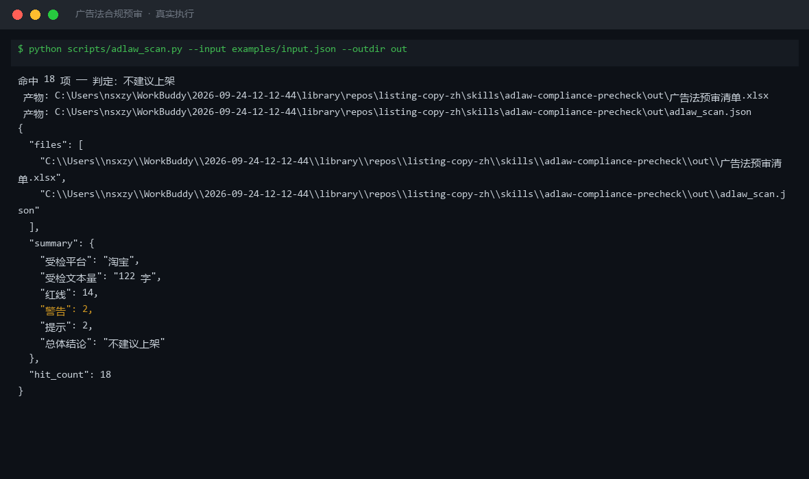

# 截图与录屏

> 以下素材均来自**真实执行**：`--run` 实拍终端 / 实跑产物文件，无摆拍。

## 演示视频


*四幕检测叙事（Hyperframes 动态渲染 19s）：业务钩子 → 真实执行 → 检查项逐条亮灯 → 交付物*

## 执行截图



## 实跑产物

| 文件 | 说明 |
|---|---|
| [`out/adlaw_scan.json`](out/adlaw_scan.json) | 结构化结果（实跑生成） · 8 KB |
| [`out/广告法预审清单.xlsx`](out/广告法预审清单.xlsx) | Excel 工作簿（实跑生成） · 10 KB |


---

## 附录：实跑输出明细

> 本资产为纯提示词客户端资产，无界面可截图。以下为**实跑运行效果**。

## 运行效果

### 输入

```json
{
  "text": "待检查的文案内容",
  "platform": "小红书",
  "rules": "扣点 5%，运费模板 A"
}

```

### 输出

## 总体判定

| 项 | 内容 |
|----|------|
| 待检文本 | 待检查的文案内容 |
| 目标平台 | 小红书 |
| 规则说明 | 扣点 5%，运费模板 A |
| 总体结论 | 输入文本为占位符，无实质文案内容可检；建议提供真实文案后再执行预审 |

## 违规项

| # | 违规词/表述 | 原文片段 | 违反规则 | 修改建议 |
|---|---|---|---|---|
| — | — | — | — | 待检文本为占位符，未发现实质违规项 |

## 整体修改建议

1. 请提供真实待检文案，而非占位符文本，以便进行有效的广告法合规预审。
2. 当前输入的 rules 字段（"扣点 5%，运费模板 A"）属于平台运营规则，与广告法违禁词检测关联度低；如需检测平台规则合规性，请提供对应平台规则文档链接或完整规则文本。
3. 建议补充完整的禁用词词表，或明确使用通用广告法词表进行预审。

*AI 生成内容*


---

*运行效果由实跑验证生成*
