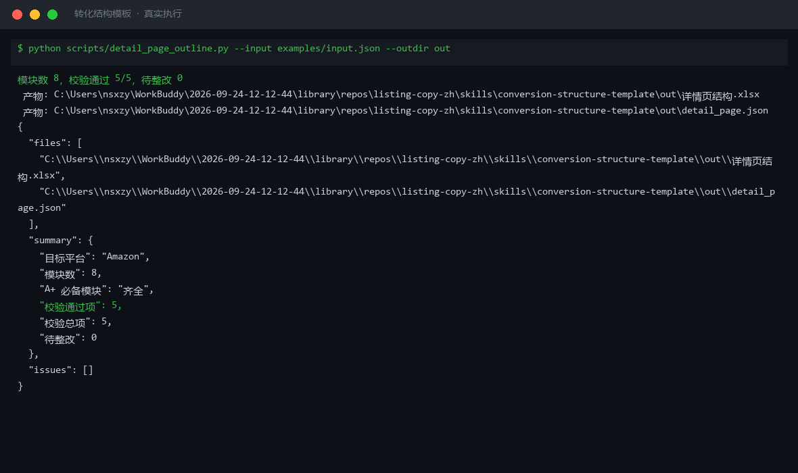
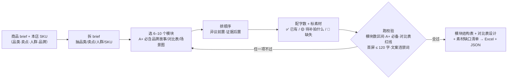

# 转化结构模板 Conversion Structure Template

> 原子技能 ｜ 属于「Listing 文案师」 ｜ 电商小卖家客群 ｜ T2 提示词 + 确定性校验脚本（ID `de_ecom_07_sk04`）
>
> **把商品卖点搭成模块化、可排版、可直接交付美工的详情页 / A+ 页面骨架，每个模块标明功能定位、字数与素材要求。**
> 10 个标准模块库 · 模块数硬约束 6–10 · 移动端首屏 ≤ 120 字 · 对比表 5 条判定口径（只准写本店 SKU）· 素材缺口三级标注（✅ / 🟡 / 🔴）




🎬 **[▶ 观看高清完整版（mp4）](https://cdn.jsdelivr.net/gh/bangwozuo/listing-copy-zh@main/skills/conversion-structure-template/docs/assets/demo.mp4)** — 四幕创作叙事：业务钩子 → 真实执行 → 要点到成稿演变 → 交付物

*上图来自真实执行：Amazon 保温杯 A+ 页面 8 模块结构实跑校验，5/5 检查项通过、首屏 112 字 ≤ 120、待整改 0，产物落盘 Excel + JSON。*

---

## 它做什么（模块库 + 排序逻辑 + 对比表红线）

### 一、详情页 / A+ 页面标准模块库（10 模块）

| 模块 | 功能定位 | 建议字数 | 是否必备 |
|---|---|---|---|
| 主图区 | 首屏抓眼，交代「这是什么」 | 主标题 ≤ 12 字 + 3 短标签 | 必备 |
| 痛点共鸣 | 让人群觉得「说的就是我」 | 40–80 字 | 必备 |
| 卖点图文 | 逐条给解决方案（1 卖点 1 图） | 每模块 40–80 字 | 必备 |
| 品牌故事 | 建立信任，弱化比价 | 80–150 字 | A+ 必备 |
| 对比表 | 帮用户在本店内选规格 | 表头 ≤ 6 项 | A+ 必备 |
| 场景图 | 展示使用场景，代入感 | 配文 ≤ 30 字 | A+ 必备 |
| 规格表 | 参数如实，降低退货 | 表格，无叙述 | 必备 |
| FAQ / 包装清单 / 售后承诺 | 拦截咨询 / 防少件纠纷 / 降风险 | 5–8 条 / 列表 / ≤ 40 字 | 建议·建议·必备 |

**硬约束**：整页模块数 **6–10 个**（< 6 信息不足，> 10 用户流失）；移动端第 1 屏总字数 **≤ 120 字**。

### 二、对比表红线（违规高发区）

| 写法 | 判定 |
|---|---|
| 对比本店 A 款 / B 款规格 | ✅ 合规 |
| 写竞品品牌名并对比参数 | 🔴 违规（商业诋毁 / 商标使用） |
| 「比 XX 品牌更好」「XX 是智商税」 | 🔴 违规（《反不正当竞争法》第十一条） |
| 「其他品牌」泛指且不贬低 | 🟡 需谨慎（可能判「影射竞品」） |

**结论：对比表只准写本店 SKU 之间的差异，且表述中性、可验证。**

### 三、模块排序逻辑（决定转化）

```
主图区 → 痛点共鸣 → 卖点图文（差异化放第 1） → 场景图 → 品牌故事 → 对比表 → 规格表 → FAQ → 包装清单 → 售后承诺
```

异议前置（最大购买顾虑进前 3 模块）· 证据后置（参数放规格表）· 信任模块放中后段 · 前 3 屏（约 300 字）要能独立成立。

## 真实输入 → 真实输出

**输入**（`examples/input.json` 关键字段）：

```json
{
  "platform": "Amazon",
  "brief": {"品类": "304 不锈钢真空保温杯", "品牌": "MUGGO", "本店 SKU": ["500ml 保温款", "350ml 迷你款", "700ml 焖烧款"]},
  "modules": [{"模块": "主图区", "建议字数": 12, "素材状态": "✅"}, {"模块": "痛点共鸣", "建议字数": 48, "素材状态": "🟡"}, "…共 8 个"]
}
```

**输出**（脚本实跑，节选）：

| # | 模块 | 功能定位 | 建议字数 | 素材状态 |
|---|---|---|---|---|
| 1 | 主图区 | 首屏抓眼 | 12 | ✅ |
| 2 | 痛点共鸣 | 建立共鸣 | 48 | 🟡（拍办公室桌面对比图） |
| 6 | 对比表 | 店内导购 | — | ✅（仅本店 3 SKU） |

| 检查项 | 结果 |
|---|---|
| 模块数在 6–10 | ✅ 当前 8 个 |
| A+ 必备模块齐全 | ✅ 品牌故事/对比表/场景图 均有 |
| 首屏（前 3 模块）字数 ≤ 120 | ✅ 当前 112 字 |
| 模块文案无绝对化/导流 | ✅ 无命中 |

完整结构见 [`examples/output.md`](examples/output.md)；Excel 产物：`out/详情页结构.xlsx`。

## 处理流水线



## 快速开始

**方式一：提示词（任意 AI 工具）**

```text
1. 打开 prompt.txt，全文复制
2. 粘贴到 Coze / WorkBuddy / Dify / Claude / ChatGPT
3. 按 schema.json 的输入规格提供：brief（品类/卖点/人群/品牌/本店 SKU）
```

**方式二：脚本（零 AI 依赖，确定性校验）**

```bash
python scripts/detail_page_outline.py --input examples/input.json --outdir out
```

## 该用 / 别用

| ✅ 该用 | ❌ 别用 |
|---|---|
| 上新前搭详情页 / A+ 页面骨架，直接交付美工排版 | 写卖点本身（转卖点文案）、写标题（转关键词组合） |
| 校验已有详情页结构（首屏过载 / 模块缺失 / 对比表踩线） | 做合规终审（转广告法预审） |
| 盘点素材缺口，明确每个模块「拍什么」 | 编造素材内容（没拍过的图写成「实拍场景图」） |
| 本店多 SKU 导购对比 | 对比表出现竞品品牌名或贬低话术 |

## 边界与合规

- 本资产输出为 **AI 辅助生成内容**，排版定稿前必须人工确认，并按平台要求完成 AI 内容标识
- 对比表与参数表须与实物一致，虚假参数属平台违规
- 平台 A+ 模块能力与尺寸限制以平台官方最新公示为准

## 文件地图

```text
├── README.md                        ← 本文件
├── SKILL.md                         ← 资产定义（元信息 / 契约 / 边界）
├── prompt.txt                       ← 提示词本体（10 模块库 + 对比表红线 + 输出格式）
├── schema.json                      ← 输入输出契约（机器可读）
├── scripts/detail_page_outline.py   ← 确定性校验脚本（模块/首屏/对比表 → Excel/JSON）
├── examples/                        ← 真实输入 + 脚本实跑输出
├── docs/                            ← 10 项配套文档（架构 / 流程 / 场景 / 测试报告…）
└── out/                             ← 实跑产物（详情页结构.xlsx / detail_page.json）
```

---

*本资产遵循 [bangwozuo 数字员工资产规范](https://github.com/bangwozuo/digital-employee-spec) v3.0 ｜ [所属员工：Listing 文案师](../../) ｜ [总入口](https://github.com/bangwozuo/digital-employees-hub-zh)*
