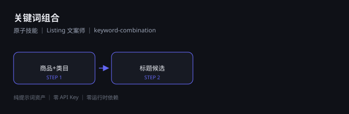

# 关键词组合

> 原子技能 ｜ 属于「Listing 文案师」 ｜ 电商小卖家 客群 ｜ ID `de_ecom_07_sk01`

按目标平台的**字数硬上限**与「位置即权重」规则，把核心词、属性词、场景词、长尾词
组合成可被检索、可被点击、不违规的**标题候选**，并给出关键词三处落位表。



---

## 这是什么

`关键词组合` 是一个**原子技能**资产：一份可直接粘贴到任意 AI 工具的提示词，
外加一个**离线可跑的校验脚本**（字数 / 核心词位置 / 词元重复 / 违禁词）。

| 特性 | 说明 |
|------|------|
| 零 API Key | 不需要任何密钥 |
| 零部署 | 无需服务端；脚本用本机 Python 直接跑 |
| 平台无关 | Coze / WorkBuddy / Dify / Claude / ChatGPT 均可 |
| 用户自备算力 | 模型来自你自己的订阅 |

## 快速开始

**方式一 · 纯提示词**

```text
1. 打开 skills/keyword-combination/prompt.txt
2. 全文复制，粘贴到你的 AI 工具
3. 按输入规格提供 product_info + platform
```

**方式二 · 带脚本（产出 Excel 校验单）**

```bash
python scripts/title_keyword_check.py --input examples/input.json --outdir out
```

产物：`out/标题关键词校验.xlsx`、`out/keyword_check.json`

## 能力要点

| 平台 | 标题上限 | 计数口径 |
|---|---|---|
| 淘宝 / 天猫 / 拼多多 | 60 | 字符 |
| 抖音 | 30 | 字（汉字） |
| 小红书 | 20 | 字（汉字） |
| Amazon | 200 | 字符 |

核心词须前置到**前 10 字符**；蓝海词（KD ≤ 0.2）不进标题、只进卖点与详情页。

## 文件地图

```text
├── README.md                ← 本文件
├── SKILL.md                 ← 资产定义（元信息 / 契约 / 边界）
├── prompt.txt               ← 提示词本体（核心交付物）
├── schema.json              ← 输入输出契约（机器可读）
├── scripts/                 ← 离线校验脚本（产出 Excel）
├── examples/                ← 示例输入与实跑输出
└── docs/                    ← 10 项配套文档
```

## 面向谁 / 解决什么

- **用户群体**：淘宝 / 抖店 / 拼多多 / 小红书店铺小卖家
- **解决痛点**：标题靠抄、字数超限被截断、违禁词上架被驳回
- **衡量指标**：搜索曝光量、点击率（CTR）、上架一次通过率

详见 [使用示例](docs/04-examples.md) 与 [测试报告](docs/09-test-report.md)。

## 合规

- 本资产输出为 **AI 辅助生成内容**，发布前必须经人工审核
- 不编造 KD / 搜索量数据；平台规则以官方最新公示为准
- 请按所在平台要求完成 **AI 生成内容标识**

---

*本资产遵循 [bangwozuo 数字员工资产规范](https://github.com/bangwozuo/digital-employee-spec) v3.0*
