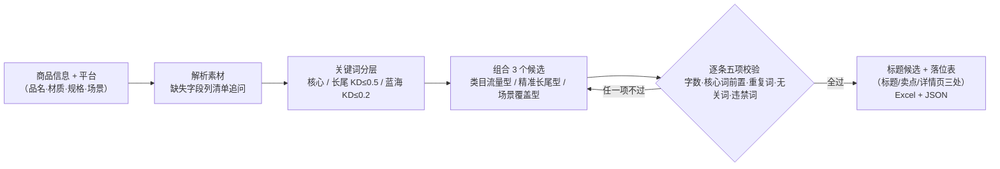

# 关键词组合 Keyword Combination

> 原子技能 ｜ 属于「Listing 文案师」 ｜ 电商小卖家客群 ｜ T2 提示词 + 确定性校验脚本（ID `de_ecom_07_sk01`）
>
> **把类目词、属性词、场景词、长尾词按平台搜索权重规则组合成可被检索、可被点击、不违规的标题候选，并给出关键词三处落位表。**
> 内置 6 个平台字数硬上限 · 4 层关键词分级（核心/属性/场景/长尾）· KD 阈值两档（长尾 ≤ 0.5 / 蓝海 ≤ 0.2）· 5 项逐条校验（字数 / 核心词前置 / 重复词 / 无关词 / 违禁词）


🎬 **[▶ 观看演示视频（在线播放）](https://cdn.jsdelivr.net/gh/bangwozuo/listing-copy-zh@main/skills/keyword-combination/docs/assets/demo.mp4) · [GitHub 页](https://github.com/bangwozuo/listing-copy-zh/blob/main/skills/keyword-combination/docs/assets/demo.mp4)** — 四幕创作叙事：业务钩子 → 真实执行 → 要点到成稿演变 → 交付物

*上图来自真实执行：淘宝保温杯 4 个标题候选实跑校验，3 个可用、1 个命中 4 处《广告法》绝对化用语被判「需修改」，产物落盘 Excel + JSON。*

---

## 它做什么（平台规则 + 词级体系）

### 一、6 个平台标题字数硬上限（超限一律不得标「可用」）

| 平台 | 字符上限 | 汉字上限 | 计数口径 |
|---|---|---|---|
| 淘宝 / 天猫 / 拼多多 | 60 字符 | 30 汉字 | 输入框硬截断，超了直接丢尾 |
| 抖音（抖店） | 30 字 | 30 汉字 | 按汉字个数算，标点空格计入 |
| 小红书（笔记标题） | 20 字 | 20 汉字 | 超出折行，影响点击不影响搜索 |
| Amazon（英文） | 200 字符 | — | 含空格；移动端约 80 字符后折叠 |

素材装不下时按「长尾词 → 场景词 → 属性词」从后往前砍，**核心词永不删**。

### 二、标题结构：位置即权重

```
[核心词] → [属性词] → [场景词] → [长尾词/修饰词]
```

| 层级 | 例（保温杯类目） | 权重 | 是否必含 |
|---|---|---|---|
| 核心词 | 保温杯 / 焖烧杯 | ★★★★★ | **必含且前置（起始位置 ≤ 第 10 字符）** |
| 属性词 | 304不锈钢、500ml | ★★★★ | 2–4 个 |
| 场景词 | 办公室、车载、学生 | ★★★ | 1–2 个 |
| 长尾词 | 便携带茶隔、大容量女款 | ★★ | 装得下就放，放不下砍它 |

### 三、KD 分层与密度红线

| 分层 | KD 阈值 | 用途 |
|---|---|---|
| 核心词 | 不适用（必争，1 个，最多 2 个且相邻） | 标题最前，吃类目流量 |
| 长尾词 | KD ≤ 0.5，取最小 2–3 个 | 标题中后段，吃精准转化 |
| 蓝海词 | KD ≤ 0.2 | **不进标题**，放卖点与详情页 |

- 核心词密度 ≤ 30%；同一属性词不得重复 ≥ 2 次；标题内不得出现无关类目蹭流量词
- 无真实 KD 数据时标「待补数据」，**不得编造具体数值**

## 真实输入 → 真实输出

**输入**（`examples/input.json` 关键字段）：

```json
{
  "platform": "淘宝",
  "core_word": "保温杯",
  "keywords": [
    {"词": "保温杯", "层级": "核心词"},
    {"词": "带茶隔保温杯", "层级": "长尾词"},
    {"词": "车载焖烧杯", "层级": "蓝海词"}
  ],
  "candidate_titles": ["保温杯 304不锈钢 500ml 办公室便携带茶隔", "…", "…", "全网最低价保温杯 100%保温 销量第一 独家304不锈钢"]
}
```

**输出**（脚本实跑，4 候选校验，节选）：

| # | 标题 | 字数 | 占上限 | 核心词位置 | 结论 |
|---|---|---|---|---|---|
| 1 | 保温杯 304不锈钢 500ml 办公室便携带茶隔 | 25 | 42% | 第 1 字符 | 可用 |
| 2 | 带茶隔保温杯 大容量女款 500ml 304不锈钢 通勤车载 | 30 | 50% | 第 4 字符 | 可用 |
| 4 | 全网最低价保温杯 100%保温 销量第一 独家304不锈钢 | 29 | 48% | 第 6 字符 | 🔴 需修改（命中 最低 / 100% / 第一 / 独家 4 处） |

完整结果见 [`examples/output.md`](examples/output.md)；Excel 产物：`out/标题关键词校验.xlsx`（结论摘要 + 标题候选校验 + 关键词布局 + 整改建议）。

## 处理流水线



## 快速开始

**方式一：提示词（任意 AI 工具）**

```text
1. 打开 prompt.txt，全文复制
2. 粘贴到 Coze / WorkBuddy / Dify / Claude / ChatGPT
3. 按 schema.json 的输入规格提供：product_info + platform（+ 已知 keywords）
```

**方式二：脚本（零 AI 依赖，确定性校验）**

```bash
python scripts/title_keyword_check.py --input examples/input.json --outdir out
```

## 该用 / 别用

| ✅ 该用 | ❌ 别用 |
|---|---|
| 上新前批量生成 / 校验标题，字数超限与违禁词一次查清 | 写详情页文案、促销方案（转卖点文案 / 转化结构模板） |
| 已有标题只做五项校验（传 `candidate_titles` 即不重新生成） | 要求编造 KD 值、搜索量、竞品数据 |
| 跨平台复用同一标题能力（6 平台规则内置） | 100% 准确零人工（AI 输出必须人工复核后上架） |
| 需要关键词在标题/卖点/详情页三处的落位表 | 抓取需登录的私域搜索数据 |

## 边界与合规

- 本资产输出为 **AI 辅助生成内容**，发布前必须人工确认，并按平台要求完成 AI 内容标识
- 不编造 KD / 搜索量数据；平台字数上限与审核规则以官方最新公示为准
- 涉及品牌词须确认已获授权，未授权品牌词不得写入标题

## 文件地图

```text
├── README.md                        ← 本文件
├── SKILL.md                         ← 资产定义（元信息 / 契约 / 边界）
├── prompt.txt                       ← 提示词本体（6 平台上限 + 词级体系 + 输出格式）
├── schema.json                      ← 输入输出契约（机器可读）
├── scripts/title_keyword_check.py   ← 确定性校验脚本（五项校验 → Excel/JSON）
├── examples/                        ← 真实输入 + 脚本实跑输出
├── docs/                            ← 10 项配套文档（架构 / 流程 / 场景 / 测试报告…）
└── out/                             ← 实跑产物（标题关键词校验.xlsx / keyword_check.json）
```

---

*本资产遵循 [bangwozuo 数字员工资产规范](https://github.com/bangwozuo/digital-employee-spec) v3.0 ｜ [所属员工：Listing 文案师](../../) ｜ [总入口](https://github.com/bangwozuo/digital-employees-hub-zh)*
