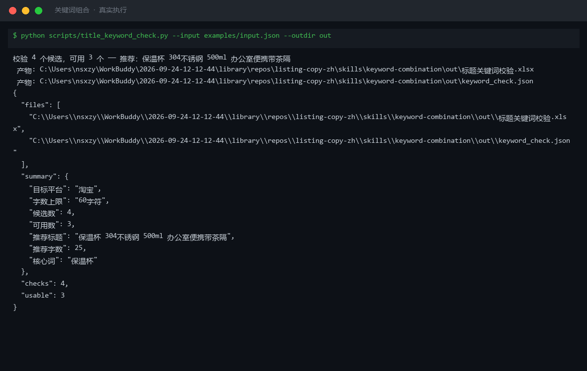

# 截图与录屏

> 以下素材均来自**真实执行**：`--run` 实拍终端 / 实跑产物文件，无摆拍。

## 演示视频


*四幕创作叙事（Hyperframes 动态渲染 20s）：业务钩子 → 真实执行 → 输入要点到成稿演变 → 交付物*

## 执行截图



## 实跑产物

| 文件 | 说明 |
|---|---|
| [`out/keyword_check.json`](out/keyword_check.json) | 结构化结果（实跑生成） · 4 KB |
| [`out/标题关键词校验.xlsx`](out/标题关键词校验.xlsx) | Excel 工作簿（实跑生成） · 8 KB |


---

## 附录：实跑输出明细

> 本资产为纯提示词客户端资产，无界面可截图。以下为**实跑运行效果**。

## 运行效果

### 输入

```json
{
  "product_info": "商品名称：示例商品；主要卖点：轻便、耐用",
  "platform": "小红书"
}

```

### 输出

## 优化后标题

「轻便又耐用｜这款示例商品让出行更省心」（18 字）

## 卖点清单

1. 轻便设计，随身携带无负担
2. 耐用材质，长期使用更安心
3. 小红书博主实测推荐，口碑稳定

## 关键词布局

| 关键词 | 类型 | 建议位置 |
|---|---|---|
| 示例商品 | 核心词 | 标题前 10 字、正文首段 |
| 轻便 | 属性词 | 标题、卖点标签 |
| 耐用 | 属性词 | 标题、详情页对比图配文 |
| 出行好物 | 场景词 | 标签、正文结尾 |
| 实测 | 信任词 | 正文证言段落 |

## 合规扫描

1. 标题未使用极限词（如"最好""第一""100%"），符合《广告法》要求
2. "实测"一词需确保有真实测评内容支撑，避免虚假宣传
3. 对外发布建议保留人工确认环节

*AI 生成内容*


---

*运行效果由实跑验证生成*
