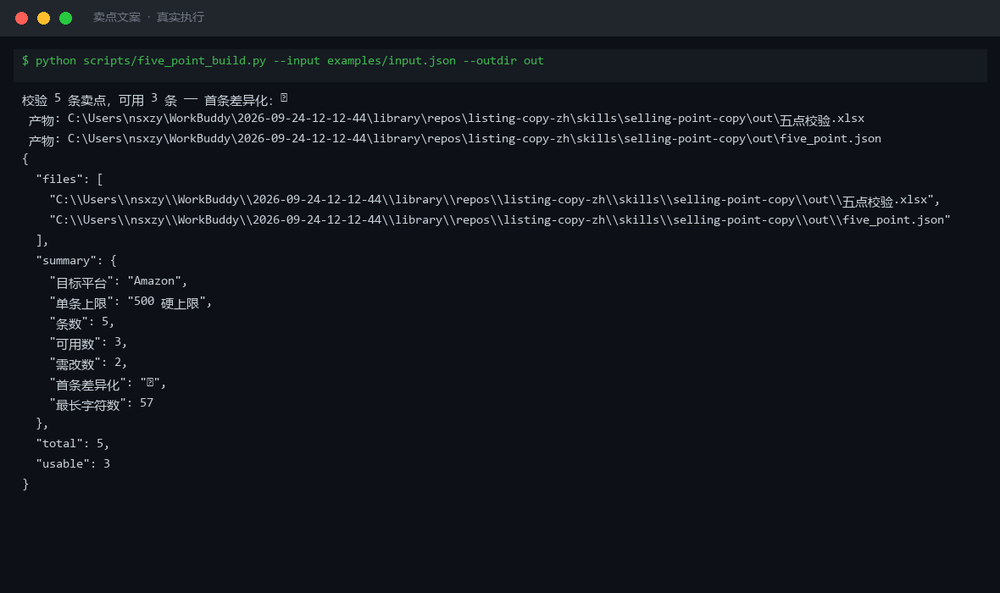
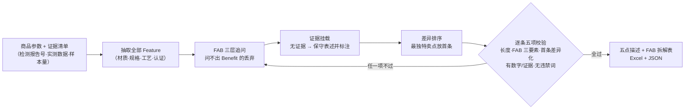

# 卖点文案 Selling Point Copy

> 原子技能 ｜ 属于「Listing 文案师」 ｜ 电商小卖家客群 ｜ T2 提示词 + 确定性校验脚本（ID `de_ecom_07_sk02`）
>
> **把商品物理属性通过 FAB 三层追问（Feature → Advantage → Benefit）翻译成用户能感知的收益，按平台规则排成可上架的五点描述 / 卖点清单。**
> Amazon 五点硬规则（单条 ≤ 500 字符 · 固定 5 条 · 首条最大差异化）· 6 平台呈现规格 · 4 级证据分级 · 5 项逐条校验




🎬 **[▶ 观看高清完整版（mp4）](https://cdn.jsdelivr.net/gh/bangwozuo/listing-copy-zh@main/skills/selling-point-copy/docs/assets/demo.mp4)** — 四幕创作叙事：业务钩子 → 真实执行 → 要点到成稿演变 → 交付物

*上图来自真实执行：Amazon 保温杯 5 条卖点实跑校验，3 条可用、2 条需改（命中「优质 / 最低 / 100% / 永久 / 比某品牌 / 加微信」等违禁项），产物落盘 Excel + JSON。*

---

## 它做什么（FAB 追问 + 证据分级）

### 一、Amazon 五点描述硬规则

| 规则 | 数值 | 说明 |
|---|---|---|
| 单条字符上限 | **≤ 500 字符**（含空格） | 超出会被截断或不通过 |
| 条数 | 5 条 | 亚马逊固定 5 个 bullet |
| 首条定位 | **最大差异化卖点** | 首条决定用户是否继续读 |
| 结构 | 核心卖点 + 支撑证据 + 用户收益 | 三段缺一即为不合格 |
| 禁止 | 促销语、价格、竞品名、联系方式、全大写堆砌 | 亚马逊 style guide |

### 二、FAB 三层追问（每条至少问满 3 层）

```text
Feature（物理属性）   →  Advantage（带来的优势）  →  Benefit（用户得到的好处）
"304 不锈钢内胆"         "耐腐蚀、不残留异味"          "泡茶泡咖啡不串味，清洗省事"
```

- ❌「采用 304 不锈钢」——停在 Feature，没有收益，判不合格
- ❌「优质材料，品质保证」——无信息量形容词，属禁用空话
- ✅ 三层问满且收益可**量化或感知**（更快 / 更省 / 更耐用 / 更省心）才可交付

### 三、支撑证据分级（决定敢不敢写）

| 证据类型 | 可写的表述 | 不可写的表述 |
|---|---|---|
| 第三方检测报告（有编号） | 「通过 GB 4806.9 检测（报告号 XXX）」 | — |
| 自测数据（有样本量） | 「实测 12 小时后 ≥ 55℃（样本 3 次）」 | 「保温 24 小时」 |
| 无任何数据 | 「12 小时保温（实验室口径）」 | 「永久保温」「绝对保温」 |
| 用户口碑（有后台依据） | 「店铺评分 4.9（近 30 天）」 | 「100% 好评」 |

**没有证据的绝对化表述一律不得写。**

## 真实输入 → 真实输出

**输入**（`examples/input.json` 关键字段）：

```json
{
  "platform": "Amazon",
  "evidence": [
    "GB 4806.9 检测报告号 SZ2026-1188",
    "自测：500ml 热水 12h 后 ≥ 55℃（样本 3 次）"
  ],
  "points": ["304不锈钢内胆耐腐蚀，泡茶泡咖啡不串味，杯身冲洗即净", "…", "采用优质材料", "全网最低价，100%保温，永久不漏，比某品牌好，加微信领券"]
}
```

**输出**（脚本实跑，5 条校验，节选）：

| # | 卖点 | 字符数 | F | A | B | 结论 |
|---|---|---|---|---|---|---|
| 1 | 304不锈钢内胆耐腐蚀，泡茶泡咖啡不串味，杯身冲洗即净 | 27 | ✅ | ✅ | ✅ | 可用 |
| 2 | 316外壳+真空层…实测12小时后水温≥55℃（样本3次）… | 57 | ✅ | ✅ | ✅ | 可用 |
| 4 | 采用优质材料 | 6 | ✅ | — | — | 🔴 需修改（Feature-only + 空话形容词） |
| 5 | 全网最低价，100%保温，永久不漏…加微信领券 | 29 | — | ✅ | — | 🔴 需修改（绝对化 + 导流 + 贬低竞品） |

完整 FAB 拆解与逐条整改建议见 [`examples/output.md`](examples/output.md)；Excel 产物：`out/五点校验.xlsx`（结论摘要 + 五点校验 + 违规明细 + FAB 拆解 + 整改建议）。

## 处理流水线



## 快速开始

**方式一：提示词（任意 AI 工具）**

```text
1. 打开 prompt.txt，全文复制
2. 粘贴到 Coze / WorkBuddy / Dify / Claude / ChatGPT
3. 按 schema.json 的输入规格提供：product_info + platform（+ evidence / 已有 points）
```

**方式二：脚本（零 AI 依赖，确定性校验）**

```bash
python scripts/five_point_build.py --input examples/input.json --outdir out
```

## 该用 / 别用

| ✅ 该用 | ❌ 别用 |
|---|---|
| 上架前把参数翻译成用户收益（Amazon 五点 / 中文平台卖点段） | 写标题（转关键词组合）、做合规终审（转广告法预审） |
| 已有卖点逐条校验 FAB 三要素与违禁词（传 `points` 即不重新编） | 写没有证据的绝对化表述（最好 / 100% / 永久） |
| 有检测报告、实测样本量需要挂载到卖点里 | 在卖点里写促销语、价格、竞品名、联系方式 |
| 跨平台适配（6 平台字数与口吻规则内置） | 编造检测报告号、专利号、样本量、销量 |

## 边界与合规

- 本资产输出为 **AI 辅助生成内容**，发布前必须人工确认，并按平台要求完成 AI 内容标识
- 涉及功效的表述须保留证据出处，无法提供的按保守表述改写
- 平台字数与 style guide 会调整，以平台官方最新公示为准

## 文件地图

```text
├── README.md                     ← 本文件
├── SKILL.md                      ← 资产定义（元信息 / 契约 / 边界）
├── prompt.txt                    ← 提示词本体（FAB 追问法 + 证据分级 + 输出格式）
├── schema.json                   ← 输入输出契约（机器可读）
├── scripts/five_point_build.py   ← 确定性校验脚本（五项校验 → Excel/JSON）
├── examples/                     ← 真实输入 + 脚本实跑输出
├── docs/                         ← 10 项配套文档（架构 / 流程 / 场景 / 测试报告…）
└── out/                          ← 实跑产物（五点校验.xlsx / five_point.json）
```

---

*本资产遵循 [bangwozuo 数字员工资产规范](https://github.com/bangwozuo/digital-employee-spec) v3.0 ｜ [所属员工：Listing 文案师](../../) ｜ [总入口](https://github.com/bangwozuo/digital-employees-hub-zh)*
