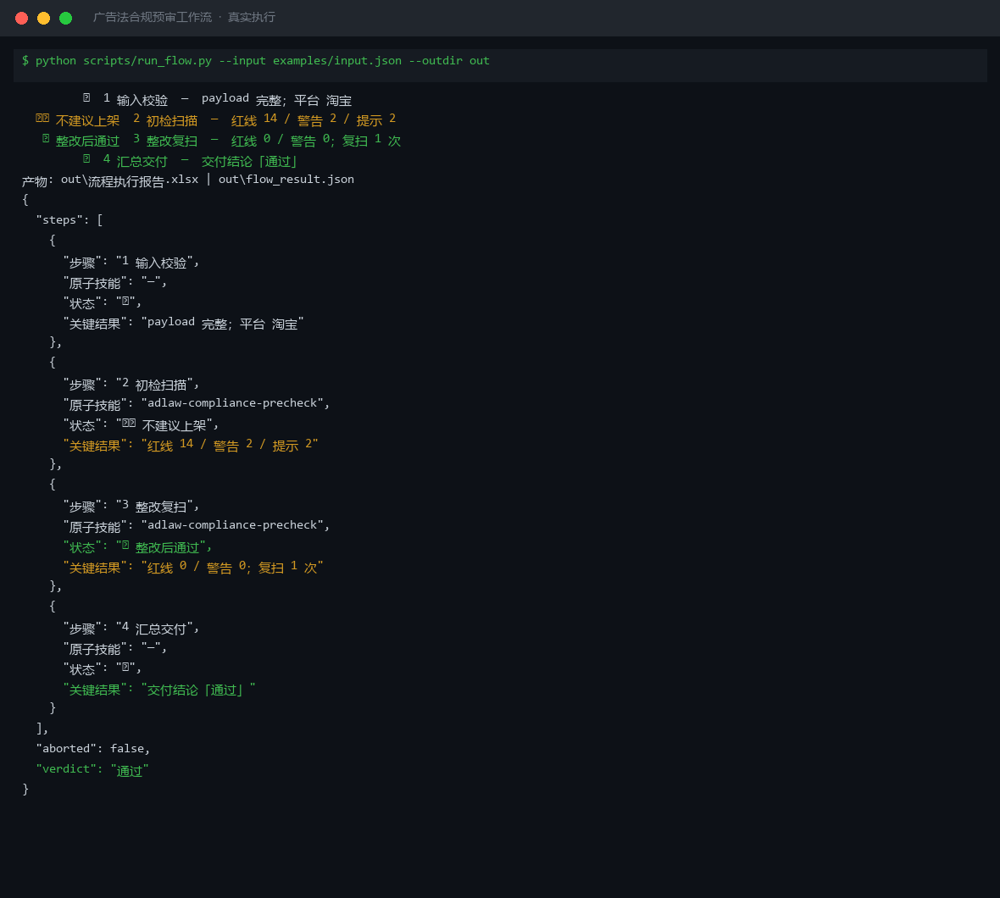
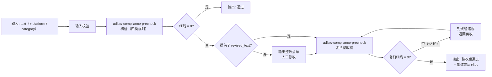

# 广告法合规预审工作流 AdLaw Compliance Flow

> 复合技能（工作流） ｜ 属于「Listing 文案师」 ｜ 电商小卖家客群 ｜ T3 编排型（脚本串联原子技能，ID `de_ecom_07_wf03`）
>
> **在文案定稿后、上架前做两遍扫描：初检把违规项挑出来，整改稿再扫一遍确认真改干净了——不只说哪儿违规，还要闭环确认。**
> 4 步链路 · 初检 + 复扫两次调用同一原子技能 · 6 条量化验收标准（5 类文本 100% 受检 / 残留极限词 = 0 / 复扫 ≤ 2 轮 / 警告 ≤ 2 才判通过）· 一次违规处罚即超全年订阅费




🎬 **[▶ 观看高清完整版（mp4）](https://cdn.jsdelivr.net/gh/bangwozuo/listing-copy-zh@main/workflows/adlaw-compliance-flow/docs/assets/demo.mp4)** — 四幕检测叙事：业务钩子 → 真实执行 → 检查项逐条亮灯 → 交付物

*上图来自真实执行：淘宝·化妆品 122 字文案端到端实跑——初检命中 18 项（红线 14），提供整改稿后复扫红线 0，一次复扫即整改通过，产物落盘 Excel + JSON。*

---

## 它做什么（初检 → 整改 → 复扫的合规闭环）

### 步骤明细

| # | 步骤 | 原子技能 | 处理 | 失败处理 |
|---|---|---|---|---|
| 1 | 输入校验 | — | 校验 `text` 非空 | 为空即中止，提示提供文案 |
| 2 | 初检扫描 | `adlaw-compliance-precheck` | 四类规则分级扫描 | 红线 = 0 → 直接交付通过 |
| 3 | 整改复扫 | `adlaw-compliance-precheck` | 对 `revised_text` 再扫一遍 | 未提供整改稿 → ⏭ 跳过，输出整改清单 |
| 4 | 汇总交付 | — | 合并两遍结果，给整改前后对比 | 复扫仍有红线 → 列残留项退回再改 |

**复扫上限 2 轮**：连续 2 轮仍有红线，判定该表述无法在不改商品实质信息的前提下合规化，中止并建议更改卖点方向。

### 量化验收标准（逐条可检验）

| # | 验收项 | 量化标准 |
|---|---|---|
| 1 | 文本覆盖率 | 标题 / 副标题 / 卖点 / 详情页 / 图上文字 **5 类 100% 受检** |
| 2 | 极限词检出 | 初检后残留极限词（五族）**必须 = 0** |
| 3 | 整改复扫 | 复扫上限 **2 轮**，超限不进入交付 |
| 4 | 通过判定 | 整改稿红线 = 0 且**警告 ≤ 2** 才判「通过」 |
| 5 | 受检文本量 | 单次 ≤ 5000 字，超出拆分多次预审，不截断、不抽检 |
| 6 | 人工确认 | 交付前保留 1 次人工确认 |

## 真实输入 → 真实输出

**输入**（`examples/input.json` 关键字段）：

```json
{
  "platform": "淘宝",
  "category": "化妆品",
  "text": "【全网最低价】医美级精华液，100%彻底淡化痘印…好评返现 5 元，加微信 xxx 领试用装…",
  "revised_text": "2026 年新款精华液，限时优惠价 ¥99。配方含神经酰胺与透明质酸，主打舒缓保湿。实测反馈良好（样本 30 人）。专利配方（ZL2026xxxxxxx）。"
}
```

**输出**（脚本端到端实跑，整改前后对比）：

| 项 | 初检 | 复扫 |
|---|---|---|
| 红线 | 14 | **0** |
| 警告 | 2 | 0 |
| 提示 | 2 | 0 |
| 结论 | 不建议上架 | **通过**（复扫 1 次） |

初检命中示例：最低 / 医美级 / 100% / 好评返现 / 加微信 / 扫码 / 比 XX 大牌好 / 无任何副作用（红线 14 项逐条引用原文片段，可溯）。完整结果见 [`examples/output.md`](examples/output.md)；产物：`out/流程执行报告.xlsx`、`out/flow_result.json`，及 `out/step2_first/`、`out/step3_review/` 两轮扫描产物目录。

## 处理流水线（DAG，节点 = 真实技能 slug）



## 快速开始

**方式一：提示词编排（任意 AI 工具）**

```text
1. 打开 prompt.txt，全文复制
2. 粘贴到 Coze / WorkBuddy / Dify / Claude / ChatGPT
3. 按 schema.json 的输入规格提供：text（+ platform / category）；有整改稿再传 revised_text
```

**方式二：端到端脚本（零 AI 依赖）**

```bash
python scripts/run_flow.py --input examples/input.json --outdir out
```

## 该用 / 别用

| ✅ 该用 | ❌ 别用 |
|---|---|
| 文案定稿后、上架前的合规闭环（初检 + 复扫一次跑完） | 替代法律意见（规则以平台官方公示为准） |
| 改完稿想知道「是否真改干净了」，要整改前后对比 | 提供谐音、拼音、拆字等规避审核的写法（违规协助，不做） |
| 类目敏感品类（化妆品/食品/医疗器械）上架前预筛 | 修改商品实质信息（价格、成分、规格的真实数值） |
| 需要 6 条量化验收逐条核对后给结论 | 100% 零人工（交付前保留人工确认环节） |

## 边界与合规

- 本资产输出为 **AI 辅助预审结果**，不得作为最终合规依据，交付前必须人工审核并按平台要求完成 AI 内容标识
- 不编造违规项、不漏报站外导流与诱导好评（处罚概率最高的两类）；不提供规避审核写法
- 本预审**不构成法律意见**；涉及类目资质须法务或平台审核确认

## 文件地图

```text
├── README.md                ← 本文件
├── SKILL.md                 ← 资产定义（DAG / 步骤明细 / 量化验收）
├── prompt.txt               ← 提示词本体（步骤链路 + 验收标准 + 输出格式）
├── schema.json              ← 输入输出契约 + DAG 声明（机器可读）
├── scripts/run_flow.py      ← 端到端编排脚本（初检 + 复扫两遍扫描 → Excel/JSON）
├── examples/                ← 真实输入 + 端到端实跑输出
├── docs/                    ← 10 项配套文档（架构 / 流程 / 场景 / 测试报告…）
└── out/                     ← 实跑产物（流程执行报告.xlsx / flow_result.json / step2_first / step3_review）
```

---

*本资产遵循 [bangwozuo 数字员工资产规范](https://github.com/bangwozuo/digital-employee-spec) v3.0 ｜ [所属员工：Listing 文案师](../../) ｜ [总入口](https://github.com/bangwozuo/digital-employees-hub-zh)*
