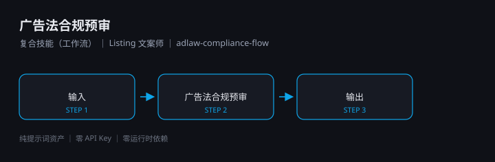

# 广告法合规预审

> 复合技能（工作流） ｜ 属于「Listing 文案师」 ｜ 电商小卖家 客群 ｜ ID `de_ecom_07_wf03`

在文案定稿后、上架前做**两遍扫描**：初检挑违规项，整改稿复扫确认改干净。



---

## 这是什么

一个 4 步工作流：输入校验 → 初检扫描 → 整改复扫 → 汇总交付，
两次调用 `adlaw-compliance-precheck` 原子技能（初检 + 复扫）。
核心是**闭环**——不只说哪儿违规，还确认整改稿是否真改干净。

| 特性 | 说明 |
|------|------|
| 零 API Key | 不需要任何密钥 |
| 零部署 | 无需服务端；脚本用本机 Python 直接跑 |
| 平台无关 | Coze / WorkBuddy / Dify / Claude / ChatGPT 均可 |
| 用户自备算力 | 模型来自你自己的订阅 |

## 快速开始

**方式一 · 纯提示词编排**

```text
1. 打开 workflows/adlaw-compliance-flow/prompt.txt
2. 全文复制，粘贴到你的 AI 工具
3. 提供 text（+ platform / category）；有整改稿再传 revised_text
```

**方式二 · 端到端脚本**

```bash
python scripts/run_flow.py --input examples/input.json --outdir out
```

产物：`out/流程执行报告.xlsx`、`out/flow_result.json`、`out/step2_first/`、`out/step3_review/`

## 编排的原子技能

| # | 原子技能 | 角色 |
|---|---|---|
| 1 | [广告法合规预审](../../skills/adlaw-compliance-precheck/) | 初检节点（第 2 步） |
| 2 | [广告法合规预审](../../skills/adlaw-compliance-precheck/) | 复扫节点（第 3 步，输入整改稿） |

## 文件地图

```text
├── README.md                ← 本文件
├── SKILL.md                 ← 资产定义（DAG / 步骤明细 / 契约）
├── prompt.txt               ← 提示词本体
├── schema.json              ← 输入输出契约 + DAG 声明
├── scripts/                 ← 编排脚本（两遍扫描端到端跑通）
├── examples/                ← 示例输入与实跑输出
└── docs/                    ← 10 项配套文档
```

## 面向谁 / 解决什么

- **用户群体**：淘宝 / 抖店 / 拼多多 / 小红书店铺小卖家
- **解决痛点**：一次违规处罚超过全年工具成本；整改完不知道是否真改干净
- **衡量指标**：上架一次通过率、违规下架次数、整改返工轮次

详见 [使用示例](docs/04-examples.md) 与 [测试报告](docs/09-test-report.md)。

## 合规

- 本资产输出为 **AI 辅助预审结果**，交付前必须经人工审核
- 不提供规避平台审核的写法；本预审**不构成法律意见**
- 请按所在平台要求完成 **AI 生成内容标识**

---

*本资产遵循 [bangwozuo 数字员工资产规范](https://github.com/bangwozuo/digital-employee-spec) v3.0*
