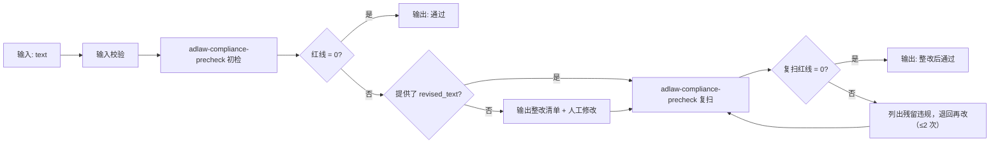

# 广告法合规预审

在文案定稿后、上架前做**两遍扫描**：初检挑违规项，整改稿复扫确认改干净。

## 元信息

| 字段 | 值 |
|------|-----|
| ID | `de_ecom_07_wf03` |
| 类型 | **`composite`（复合技能）** |
| 所属员工 | Listing 文案师 |
| 阶段 | `P0` |
| 复杂度 | `S` |
| 触发方式 | 事件（文案定稿） |
| ROI | 一次违规处罚即超全年订阅费 |
| 资产形态 | 纯提示词 + 可选 Python 编排脚本（离线、无 API Key） |

## 能力描述

广告法合规预审是一个复合技能，编排 1 个原子技能做**两遍调用**，
完成「文案 → 初检清单 → 整改稿 → 复扫确认」的完整闭环。
核心价值是**闭环**：不只告诉你哪里违规，还确认整改稿是否真的改干净了。

## 编排的原子技能

| # | 原子技能 | 能力 | 在本流程中的角色 |
|---|---------|------|-----------------|
| 1 | [adlaw-compliance-precheck](../../skills/adlaw-compliance-precheck/) | 四类规则分级扫描 | 初检节点（第 2 步） |
| 2 | [adlaw-compliance-precheck](../../skills/adlaw-compliance-precheck/) | 四类规则分级扫描 | 复扫节点（第 3 步，输入整改稿） |

> 同一原子技能被调用两次，分别位于 DAG 的初检与复扫节点。

## 步骤链路（DAG）



## 步骤明细

| # | 步骤 | 技能资产 | 输入 | 输出 | 失败处理 |
|---|------|---------|------|------|---------|
| 1 | 输入校验 | — | `text` | 规范化 payload | `text` 为空即中止，提示提供文案 |
| 2 | 初检扫描 | `../../skills/adlaw-compliance-precheck/` | `text` + `platform` + `category` | 违规清单 + 总体结论 | 扫描异常 → 中止；红线=0 → 直接交付 |
| 3 | 整改复扫 | `../../skills/adlaw-compliance-precheck/` | `revised_text` | 残留违规清单 | 未提供 `revised_text` → ⏭ 跳过；复扫仍有红线 → 退回再改（≤2 次） |
| 4 | 汇总交付 | — | 第 2/3 步产物 | 合规结论 + 整改前后对比 | 无 `revised_text` → 交付「待整改」状态 |

## 输入规格

| 字段 | 类型 | 必填 | 说明 |
|------|------|------|------|
| `text` | string | ✅ | 待检文案：标题 + 副标题 + 卖点 + 详情页 + 图上文字 |
| `platform` | string | ⬜ | 淘宝 / 天猫 / 抖音 / 拼多多 / 小红书 / 通用 |
| `category` | string | ⬜ | 化妆品 / 食品 / 保健品 / 医疗器械 / 母婴 / 教育 / 金融 |
| `revised_text` | string | ⬜ | 整改后的文案（提供则执行第 3 步复扫） |
| `rules` | string | ⬜ | 用户自定义词表或平台补充规则 |

## 输出规格

| 字段 | 类型 | 说明 |
|------|------|------|
| `steps` | array | 每步状态与关键结果 |
| `deliverable` | object | 初检结论 / 初检红线 / 复扫结论 / 最终结论 / 整改前后 |
| `violations` | array | 初检违规清单 |
| `suggestions` | array | 整体修改建议 |
| `summary` | object | 两遍扫描的红线计数 |

## 使用步骤

### 方式一：纯提示词编排（最快）

1. 打开任意 AI 工具，把 `prompt.txt` **全文**粘贴为系统提示词
2. 提供 `text`（+ `platform` / `category`）
3. 模型按 DAG 执行初检；若你有整改稿，再传 `revised_text` 触发复扫

### 方式二：带脚本端到端跑（产出流程执行报告）

```bash
python3 <FLOW_DIR>/scripts/run_flow.py --input input.json --outdir out
python3 <FLOW_DIR>/scripts/run_flow.py --demo      # 无输入也能看效果
```

产物：

| 文件 | 内容 |
|---|---|
| `out/流程执行报告.xlsx` | 步骤明细 / 违规清单 / 整改对比 / 整体建议 / 汇总 |
| `out/flow_result.json` | 机器可读结果 |
| `out/step2_first/`、`out/step3_review/` | 初检与复扫的原子技能产物 |

## 错误处理

| 情况 | 处理方式 |
|------|---------|
| `text` 缺失 | **中止流程**，提示提供文案 |
| 初检红线 = 0 | 跳过复扫，直接交付「通过」 |
| 未提供 `revised_text` | 第 3 步 ⏭ 跳过，只输出整改清单 |
| 复扫仍有红线 | 退回再改，**复扫上限 2 次**，超限中止并建议改卖点方向 |
| 原子技能脚本缺失 | 抛 `FileNotFoundError` 并中止 |

## 验收标准（量化）

| # | 验收项 | 量化标准 |
|---|---|---|
| 1 | 每一步引用的原子技能在同仓 `skills/` 下真实存在 | 存在性 = 100% |
| 2 | 文本覆盖率 | 标题 / 副标题 / 卖点 / 详情页 / 图上文字 5 类 100% 受检 |
| 3 | 极限词检出 | 初检后残留极限词必须 = 0（以脚本词表扫描为准） |
| 4 | 整改复扫 | 上限 2 轮；第 2 轮后红线仍 > 0 → 中止并改卖点方向 |
| 5 | 通过判定 | 红线 = 0 且警告 ≤ 2 才判「通过」 |
| 6 | 交付纪律 | 步骤间输入输出字段可衔接、两遍结果都落盘、末步带 AI 标识、保留 1 次人工确认 |

## 调用示例

**输入**（`examples/input.json`）：淘宝·化妆品，一段含 18 处违规的文案 + 一份整改稿。

**输出**（脚本实跑）：

| # | 步骤 | 状态 | 关键结果 |
|---|---|---|---|
| 1 | 输入校验 | ✅ | payload 完整；平台 淘宝 |
| 2 | 初检扫描 | ⚠️ 不建议上架 | 红线 14 / 警告 2 / 提示 2 |
| 3 | 整改复扫 | ✅ 整改后通过 | 红线 0 / 警告 0；复扫 1 次 |
| 4 | 汇总交付 | ✅ | 结论「通过」 |

## 所属工作流

本资产为复合技能（工作流），是独立的端到端流程，不隶属于其他工作流。

## 合规声明

- 本技能输出为 **AI 辅助预审结果**，交付前必须经人工审核
- 不提供规避平台审核的写法；平台规则以官方公示为准
- 本预审**不构成法律意见**；请按平台要求完成 AI 生成内容标识

---

*本复合技能由深度改造生成 · 2026-09-30*
