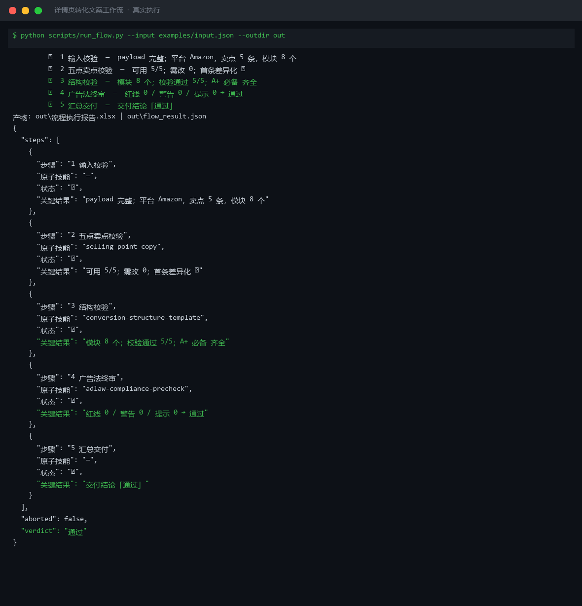
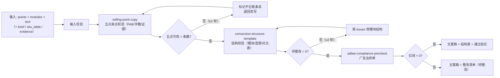

# 详情页转化文案 Detail Page Conversion Copy Flow

> 复合技能（工作流） ｜ 属于「Listing 文案师」 ｜ 电商小卖家客群 ｜ T3 编排型（脚本串联原子技能，ID `de_ecom_07_wf04`）
>
> **把三个原子技能串成端到端流程：卖点条目校验 → 详情页结构校验 → 广告法终审，输出可直接交给美工排版的详情页文案稿与合规结论。**
> 5 步链路 · 编排 3 个原子技能 · 6 条量化验收（五点可用率 100% / 模块数 6–10 / 首屏 ≤ 120 字 / 终审红线 = 0 / 竞品贬低 = 0）· 重写上限各 2 轮 · ROI ≈ 替代详情页文案外包（一套 ¥1500 起）



🎬 **[▶ 观看演示视频（在线播放）](https://cdn.jsdelivr.net/gh/bangwozuo/listing-copy-zh@main/workflows/detail-page-conversion-copy-flow/docs/assets/demo.mp4) · [GitHub 页](https://github.com/bangwozuo/listing-copy-zh/blob/main/workflows/detail-page-conversion-copy-flow/docs/assets/demo.mp4)** — 四幕检测叙事：业务钩子 → 真实执行 → 检查项逐条亮灯 → 交付物

*上图来自真实执行：Amazon 保温杯（5 条卖点 + 8 模块结构）端到端实跑——卖点可用 5/5、结构校验 5/5、广告法终审红线 0，三步全过一次交付，产物落盘 Excel + JSON。*

---

## 它做什么（三技能串联的质量流水线）

服务电商小卖家：没有专职文案，详情页要么外包（一套 ¥1500 起），要么把卖点堆成一屏字。本流程让详情页**每一屏都有一个明确的转化任务**，且上架前合规问题清零。

### 步骤明细

| # | 步骤 | 原子技能 | 处理 | 失败处理 |
|---|---|---|---|---|
| 1 | 输入校验 | — | 校验 `points` / `modules` / `text` 非空 | 任一必填缺失 → 中止，列缺失清单 |
| 2 | 五点卖点校验 | `selling-point-copy` | FAB / 字数 / 数字证据 / 违禁词逐条检查 | 不合格条目退回重写（≤ 2 轮） |
| 3 | 结构校验 | `conversion-structure-template` | 模块数 / A+ 必备 / 首屏字数 / 对比表红线 | issues 非空 → 修结构后重跑（≤ 2 轮） |
| 4 | 广告法终审 | `adlaw-compliance-precheck` | 四类规则扫描全量文案 | 红线 > 0 → 输出整改清单，判「待整改」 |
| 5 | 汇总交付 | — | 合并三步结果 | 三步结论不一致时，**以最严的一项为准** |

**重写上限**：第 2/3 步各 2 轮；2 轮后仍不达标 → 中止并输出问题清单，不进入终审（避免把明显不合格的稿子白扫一遍）。

## 真实输入 → 真实输出

**输入**（`examples/input.json` 关键字段）：

```json
{
  "platform": "Amazon",
  "points": ["304不锈钢内胆耐腐蚀…", "…共 5 条"],
  "modules": [{"模块": "主图区", "建议字数": 12}, "…共 8 个"],
  "evidence": ["GB 4806.9 检测报告号 SZ2026-1188", "…"]
}
```

**输出**（脚本端到端实跑，节选）：

| 步骤 | 原子技能 | 关键结果 |
|---|---|---|
| 2 五点卖点校验 | selling-point-copy | 可用 5/5；需改 0；首条差异化 ✅ |
| 3 结构校验 | conversion-structure-template | 模块 8 个；校验通过 5/5；A+ 必备 齐全 |
| 4 广告法终审 | adlaw-compliance-precheck | 红线 0 / 警告 0 / 提示 0 → **通过** |

完整分步结果见 `out/flow_result.json`（真实端到端产物）；产物：`out/流程执行报告.xlsx`（步骤明细 / 五点校验 / 模块结构 / 违规清单 / 汇总），及 `out/step2_selling/`、`out/step3_outline/`、`out/step4_adlaw/` 三个原子技能产物目录。

## 处理流水线（DAG，节点 = 真实技能 slug）



## 快速开始

**方式一：提示词编排（任意 AI 工具）**

```text
1. 打开 prompt.txt，全文复制
2. 粘贴到 Coze / WorkBuddy / Dify / Claude / ChatGPT
3. 按 schema.json 的输入规格提供：points + modules + text（+ brief / sku_table / evidence）
```

**方式二：端到端脚本（零 AI 依赖）**

```bash
python scripts/run_flow.py --input examples/input.json --outdir out
```

## 该用 / 别用

| ✅ 该用 | ❌ 别用 |
|---|---|
| 上新前一步到位：卖点、结构、合规三关串联，产出可交付美工的文案稿 | 只校验单点（单跑原子技能更轻） |
| 详情页外包替代：每一屏有明确转化任务 | 跳过广告法终审直接交付文案稿 |
| 对比表防踩线（竞品贬低命中 = 0） | 编造检测数据、认证编号、销量数字 |
| 首屏 ≤ 120 字 + 模块数 6–10 的结构把关 | 把不合格稿子标「基本可用」放行 |

## 边界与合规

- 本资产输出为 **AI 辅助生成内容**，上架前保留人工确认环节，并按平台要求完成 AI 内容标识
- A+ 页面对比表不得贬低竞品（平台规则 + 《反不正当竞争法》第十一条）
- 模型只负责写文案与改稿；字数、模块数、违禁词、红线等可计算项一律以脚本为准

## 文件地图

```text
├── README.md                ← 本文件
├── SKILL.md                 ← 资产定义（DAG / 步骤明细 / 量化验收）
├── prompt.txt               ← 提示词本体（步骤链路 + 验收标准 + 输出格式）
├── schema.json              ← 输入输出契约 + DAG 声明（机器可读）
├── scripts/run_flow.py      ← 端到端编排脚本（串联 3 个原子技能 → Excel/JSON）
├── examples/                ← 真实输入 + 端到端实跑输出
├── docs/                    ← 10 项配套文档（架构 / 流程 / 场景 / 测试报告…）
└── out/                     ← 实跑产物（流程执行报告.xlsx / flow_result.json / step2~step4）
```

---

*本资产遵循 [bangwozuo 数字员工资产规范](https://github.com/bangwozuo/digital-employee-spec) v3.0 ｜ [所属员工：Listing 文案师](../../) ｜ [总入口](https://github.com/bangwozuo/digital-employees-hub-zh)*
