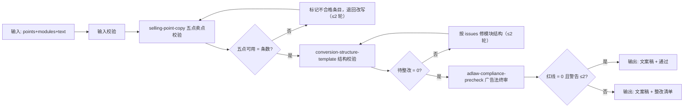

# 详情页转化文案

把卖点变成**每一屏都有明确转化任务**的详情页文案稿，并保证上架前合规问题清零。

## 元信息

| 字段 | 值 |
|------|-----|
| ID | `de_ecom_07_wf04` |
| 类型 | **`composite`（复合技能）** |
| 所属员工 | Listing 文案师 |
| 阶段 | `P1` |
| 复杂度 | `S` |
| 触发方式 | 人工（新品上架 / 老链接改版） |
| ROI | 替代详情页文案外包（一套 ¥1500 起） |
| 资产形态 | 纯提示词 + Python 编排脚本（离线、无 API Key） |

## 能力描述

编排 3 个原子技能，完成「卖点条目 → 详情页结构 → 合规终审」的端到端流程：

1. **五点卖点校验**：FAB 三层齐全性、平台字数上限、数字证据、违禁词逐条检查
2. **结构校验**：模块数 6–10、A+ 必备三模块（品牌故事/对比表/场景图）、首屏 ≤ 120 字、对比表竞品贬低红线
3. **广告法终审**：四类规则分级扫描全量文案，红线 = 0 才判「通过」

每步含失败处理与 2 轮改写上限；最终交付文案稿 + 整改清单 + 验收对照。

## 编排的原子技能

| # | 原子技能 | 能力 | 在本流程中的角色 |
|---|---------|------|-----------------|
| 1 | [selling-point-copy](../../skills/selling-point-copy/) | 五点卖点 FAB/字数/违禁词校验 | 第 2 步：卖点条目质量闸 |
| 2 | [conversion-structure-template](../../skills/conversion-structure-template/) | 详情页/A+ 结构规则校验 | 第 3 步：结构质量闸 |
| 3 | [adlaw-compliance-precheck](../../skills/adlaw-compliance-precheck/) | 广告法四类规则分级扫描 | 第 4 步：合规终审 |

## 步骤链路（DAG）



## 步骤明细

| # | 步骤 | 技能资产 | 输入 | 输出 | 失败处理 |
|---|------|---------|------|------|---------|
| 1 | 输入校验 | — | `points` / `modules` / `text` | 规范化 payload | 任一必填缺失 → 中止，列缺失字段 |
| 2 | 五点卖点校验 | `../../skills/selling-point-copy/` | `points` + `platform` + `evidence` | 五点校验表 + 可用数 | 不合格条目 → 退回改写，上限 2 轮 |
| 3 | 结构校验 | `../../skills/conversion-structure-template/` | `modules` + `sku_table` | 模块结构表 + issues | `待整改 > 0` → 按 issues 修结构，上限 2 轮；2 轮后中止 |
| 4 | 广告法终审 | `../../skills/adlaw-compliance-precheck/` | `text` + `platform` + `category` | 违规清单 + 总体结论 | 红线 > 0 → 「待整改」+ 整改清单 |
| 5 | 汇总交付 | — | 第 2/3/4 步产物 | 文案稿 + 合规结论 | 结论不一致时以最严项为准 |

## 输入规格

| 字段 | 类型 | 必填 | 说明 |
|------|------|------|------|
| `platform` | string | ✅ | 淘宝 / 天猫 / 抖音 / 小红书 / Amazon / 通用 |
| `category` | string | ⬜ | 商品类目（化妆品等会启用类目禁词表） |
| `product_info` | object | ✅ | 品名 / 材质 / 规格 / 认证 / 场景 |
| `evidence` | array | ⬜ | 检测报告号、认证编号、自测数据 |
| `points` | array | ✅ | 五点卖点条目（≥ 5 条） |
| `brief` | object | ⬜ | 品类 / 品牌 / 核心卖点 / 目标人群 / 本店 SKU |
| `modules` | array | ✅ | 模块结构：模块 / 功能定位 / 建议字数 / 素材状态 / 文案 |
| `sku_table` | array | ⬜ | 对比表 / 规格表 |
| `text` | string | ✅ | 拼合后的全量文案（模块文案 + 卖点条目） |

## 输出规格

| 字段 | 类型 | 说明 |
|------|------|------|
| `steps` | array | 每步状态与关键结果 |
| `deliverable` | object | 五点可用 / 结构待整改 / 广告法红线 / 最终结论 |
| `fixes` | array | 整改清单（来源步骤 / 问题 / 改法） |
| `summary` | object | 各步量化计数与最终结论 |

## 使用步骤

### 方式一：纯提示词编排（最快）

1. 打开任意 AI 工具，把 `prompt.txt` **全文**粘贴为系统提示词
2. 按「输入规格」提供商品资料、卖点条目与模块结构
3. 模型按 DAG 逐步执行，输出文案稿 + 整改清单

### 方式二：带脚本端到端跑（产出流程执行报告）

```bash
python3 <FLOW_DIR>/scripts/run_flow.py --input input.json --outdir out
python3 <FLOW_DIR>/scripts/run_flow.py --demo      # 无输入也能看效果
```

产物：

| 文件 | 内容 |
|---|---|
| `out/流程执行报告.xlsx` | 步骤明细 / 整改清单 / 违规清单 / 汇总（红线行标红） |
| `out/flow_result.json` | 机器可读结果 |
| `out/step2_selling/`、`out/step3_outline/`、`out/step4_adlaw/` | 三个原子技能的中间产物 |

**分工**：脚本做可计算校验（字数 / 模块数 / 违禁词 / 红线）；模型做创意撰写与改稿。

## 边界（不做的事）

- ❌ 不生成图片、不做排版（交给美工或 product-visual-zh 的排版能力）
- ❌ 不编造检测数据、认证编号、销量数字
- ❌ 对比表不写竞品名与贬低词，不提供规避审核的写法
- ❌ 不代替用户决定上架时机；交付前保留人工确认

## 错误处理

| 情况 | 处理方式 |
|------|---------|
| 必填字段缺失 | 第 1 步 ❌ 中止，列出缺失字段 |
| 五点有不合格条目 | 退回改写，上限 2 轮；超限中止 |
| 结构待整改 > 0 | 按 issues 修结构，上限 2 轮；超限中止 |
| 广告法红线 > 0 | 判「待整改」，输出逐条改法 |
| 原子技能脚本缺失 | 抛 `FileNotFoundError` 并中止 |

## 验收标准（量化）

| # | 验收项 | 量化标准 |
|---|---|---|
| 1 | 五点可用率 | 可用 / 总数 = 100%（FAB 齐全 + 字数合规 + 违禁词 0） |
| 2 | 结构校验 | 模块数 6–10、A+ 必备 3 模块齐全、待整改 = 0 |
| 3 | 首屏字数 | 前 3 个模块合计 ≤ 120 字 |
| 4 | 广告法 | 红线 = 0 且警告 ≤ 2 才判「通过」 |
| 5 | 对比表 | 竞品贬低命中 = 0 |
| 6 | 交付物 | 文案稿 + 结构表 + 合规结论三件齐全，带 AI 标识 |

## 调用示例

**输入**（`examples/input.json`）：Amazon 保温杯，5 条五点卖点 + 8 个详情页模块 + 全量文案。

**输出**（脚本实跑）：

| # | 步骤 | 状态 | 关键结果 |
|---|---|---|---|
| 1 | 输入校验 | ✅ | payload 完整；平台 Amazon，卖点 5 条，模块 8 个 |
| 2 | 五点卖点校验 | ✅ | 可用 5/5；需改 0 |
| 3 | 结构校验 | ✅ | 模块 8 个；校验通过 5/5；A+ 必备 齐全 |
| 4 | 广告法终审 | ✅ | 红线 0 / 警告 0 / 提示 0 → 通过 |
| 5 | 汇总交付 | ✅ | 结论「通过」 |

## 所属工作流

本资产为复合技能（工作流），是独立的端到端流程，不隶属于其他工作流。

## 合规声明

- 本技能输出为 **AI 生成内容**，上架前必须经人工复核
- A+ 对比表不得贬低竞品（《反不正当竞争法》第 11 条）；不提供规避审核的写法
- 平台规则以官方公示为准；类目资质表述须法务或平台确认

---

*本复合技能由深度改造生成 · 2026-09-30*
