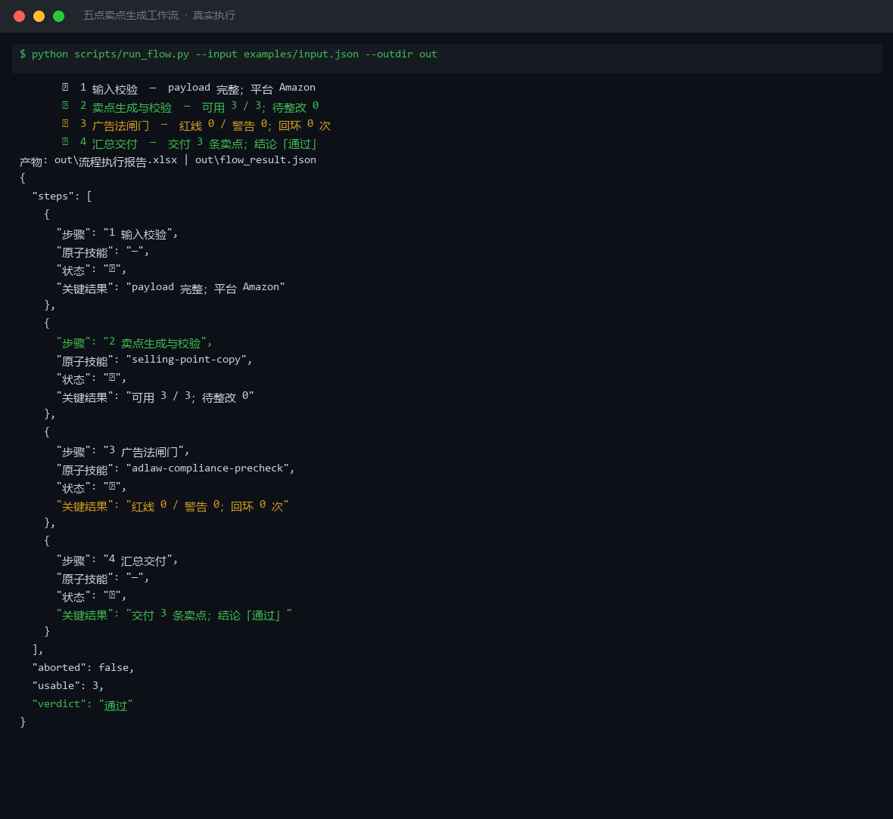
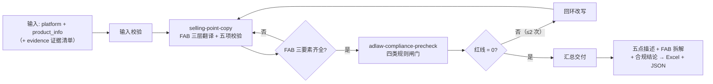

# 五点卖点生成 Five Point Sellingpoint Flow

> 复合技能（工作流） ｜ 属于「Listing 文案师」 ｜ 电商小卖家客群 ｜ T3 编排型（脚本串联原子技能，ID `de_ecom_07_wf02`）
>
> **把商品参数按 FAB 翻译成用户收益并排成五点描述，再强制过一次广告法闸门——含绝对化用语或诱导话术的卖点一律不得交付。**
> 4 步链路 · 编排 2 个原子技能 · 双闸设计（前闸拦质量：长度/FAB/证据，后闸拦法规：四类规则）· 回环上限 2 次 · 与①同场景触发零额外流程



*上图来自真实执行：Amazon 保温杯 3 条卖点端到端实跑——FAB 三要素全部齐全（带检测证据）、广告法闸门红线 0、回环 0 次，交付 3 条可用卖点，产物落盘 Excel + JSON。*

---

## 它做什么（双闸卖点流水线）

**前闸拦质量**（长度 / FAB 三要素 / 首条差异化 / 数字证据），**后闸拦法规**（《广告法》四类规则 + 类目禁词表）——两道闸都过才交付。

### 步骤明细

| # | 步骤 | 原子技能 | 处理 | 失败处理 |
|---|---|---|---|---|
| 1 | 输入校验 | — | 校验 `platform` 与 `product_info` 非空 | 缺字段即中止，列缺失清单 |
| 2 | 卖点生成与校验 | `selling-point-copy` | FAB 三层翻译；五项校验 | FAB 不全 → 标注「补充收益」，可用条目继续进闸门 |
| 3 | 广告法闸门 | `adlaw-compliance-precheck` | 四类规则分级扫描（+ `category` 禁词表） | 红线 > 0 → 回环改写，**最多 2 次** |
| 4 | 汇总交付 | — | 合并为交付清单 | 无可用卖点 → 交付「无合规卖点」并说明原因 |

**无 `evidence` 时**：所有功效表述一律走保守写法，不得升级为强断言。

## 真实输入 → 真实输出

**输入**（`examples/input.json` 关键字段）：

```json
{
  "platform": "Amazon",
  "evidence": [
    "GB 4806.9 检测报告号 SZ2026-1188",
    "自测：500ml 热水 12h 后 ≥ 55℃（样本 3 次）"
  ],
  "points": ["304不锈钢内胆耐腐蚀，泡茶泡咖啡不串味，杯身冲洗即净", "316外壳+真空层…实测≥55℃（样本3次）…", "杯盖硅胶密封圈，倒置不漏水"]
}
```

**输出**（脚本端到端实跑，节选）：

| # | 步骤 | 原子技能 | 状态 | 关键结果 |
|---|---|---|---|---|
| 2 | 卖点生成与校验 | selling-point-copy | ✅ | 可用 3 / 3；待整改 0 |
| 3 | 广告法闸门 | adlaw-compliance-precheck | ✅ | 红线 0 / 警告 0；回环 0 次 |

| # | 可用卖点 | 关键校验 |
|---|---|---|
| 1 | 304不锈钢内胆耐腐蚀，泡茶泡咖啡不串味，杯身冲洗即净 | F→A→B 齐全，含材质 |
| 2 | 316不锈钢外壳搭配真空层…实测12小时后水温≥55℃（样本3次）… | F→A→B + 实测数字 |

完整结果见 [`examples/output.md`](examples/output.md)；产物 6 个真实文件：`out/流程执行报告.xlsx`、`out/flow_result.json`，及 `out/step2_point/`、`out/step3_adlaw/` 两个原子技能产物目录。

## 处理流水线（DAG，节点 = 真实技能 slug）



## 快速开始

**方式一：提示词编排（任意 AI 工具）**

```text
1. 打开 prompt.txt，全文复制
2. 粘贴到 Coze / WorkBuddy / Dify / Claude / ChatGPT
3. 按 schema.json 的输入规格提供：platform + product_info（有检测报告/实测数据务必附 evidence）
```

**方式二：端到端脚本（零 AI 依赖）**

```bash
python scripts/run_flow.py --input examples/input.json --outdir out
```

## 该用 / 别用

| ✅ 该用 | ❌ 别用 |
|---|---|
| Amazon 五点 / 中文平台卖点段：参数翻译 + 合规一次跑完 | 写标题（转 keyword-title-combo-flow）、搭详情页结构 |
| 有检测报告、实测样本量需要挂载进卖点 | 无证据却写「永久保温」「100% 有效」 |
| 违规卖点自动回环改写（≤ 2 次） | 在卖点里写促销语、价格、竞品名、联系方式 |
| 与关键词工作流同场景触发，零额外流程 | 100% 零人工（AI 输出必须人工复核后上架） |

## 边界与合规

- 本资产输出为 **AI 辅助生成内容**，发布前必须人工确认，并按平台要求完成 AI 内容标识
- 涉及功效的表述须保留证据出处；无法提供的按保守表述改写
- 回环 ≤ 2 次，超限中止而不交付；平台字数与 style guide 以官方最新公示为准

## 文件地图

```text
├── README.md                ← 本文件
├── SKILL.md                 ← 资产定义（DAG / 步骤明细 / 契约）
├── prompt.txt               ← 提示词本体（步骤链路 + 双闸规则 + 输出格式）
├── schema.json              ← 输入输出契约 + DAG 声明（机器可读）
├── scripts/run_flow.py      ← 端到端编排脚本（串联 2 个原子技能 → Excel/JSON）
├── examples/                ← 真实输入 + 端到端实跑输出
├── docs/                    ← 10 项配套文档（架构 / 流程 / 场景 / 测试报告…）
└── out/                     ← 实跑产物（流程执行报告.xlsx / flow_result.json / step2_* / step3_*）
```

---

*本资产遵循 [bangwozuo 数字员工资产规范](https://github.com/bangwozuo/digital-employee-spec) v3.0 ｜ [所属员工：Listing 文案师](../../) ｜ [总入口](https://github.com/bangwozuo/digital-employees-hub-zh)*
