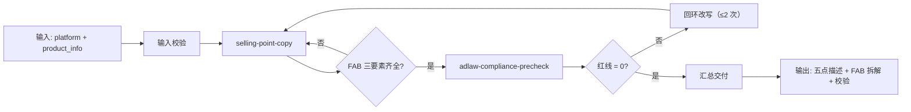

# 五点卖点生成

把商品参数翻译成用户收益并排成五点描述，再**强制过一次广告法闸门**——
含绝对化用语或诱导话术的卖点一律不得交付。

## 元信息

| 字段 | 值 |
|------|-----|
| ID | `de_ecom_07_wf02` |
| 类型 | **`composite`（复合技能）** |
| 所属员工 | Listing 文案师 |
| 阶段 | `P0` |
| 复杂度 | `S` |
| 触发方式 | 人工 |
| ROI | 与①同场景触发，零额外流程 |
| 资产形态 | 纯提示词 + 可选 Python 编排脚本（离线、无 API Key） |

## 能力描述

五点卖点生成是一个复合技能，按业务顺序编排 2 个原子技能，
完成「商品资料 → FAB 收益句 → 合规闸门 → 可用五点」的完整流程。
核心价值在于**证据与合规双闸**：无证据的强表述与违禁词都在交付前被拦下。

## 编排的原子技能

| # | 原子技能 | 能力 | 在本流程中的角色 |
|---|---------|------|-----------------|
| 1 | [selling-point-copy](../../skills/selling-point-copy/) | FAB 翻译 + 五点校验 | 主生产节点 |
| 2 | [adlaw-compliance-precheck](../../skills/adlaw-compliance-precheck/) | 广告法四类规则分级扫描 | 质量闸门（红线 > 0 回环） |

## 步骤链路（DAG）



## 步骤明细

| # | 步骤 | 技能资产 | 输入 | 输出 | 失败处理 |
|---|------|---------|------|------|---------|
| 1 | 输入校验 | — | `platform` + `product_info` | 规范化 payload | 缺字段即中止，列出缺失清单 |
| 2 | 卖点生成与校验 | `../../skills/selling-point-copy/` | 第 1 步输出 + `evidence` | 五点描述 + FAB 拆解 | FAB 不全 → 标「补充收益」，可用条目继续 |
| 3 | 广告法闸门 | `../../skills/adlaw-compliance-precheck/` | 第 2 步可用卖点拼接文本 | 违规清单 + 总体结论 | 红线 > 0 → 回环到第 2 步改写，最多 2 次；超限中止 |
| 4 | 汇总交付 | — | 第 2/3 步产物 | 可用五点 + 合规结论 + 待整改 | 无可用卖点 → 交付「无合规卖点」并说明原因 |

## 输入规格

| 字段 | 类型 | 必填 | 说明 |
|------|------|------|------|
| `platform` | string | ✅ | Amazon / 淘宝 / 天猫 / 抖音 / 拼多多 / 小红书 |
| `product_info` | object | ✅ | 品名、材质、规格、参数、已证实卖点、适用人群 |
| `points` | array | ⬜ | 已有卖点；提供则只做校验与改写 |
| `evidence` | array | ⬜ | 检测报告号、专利号、实测数据与样本量 |
| `category` | string | ⬜ | 类目，决定闸门启用哪张禁词表 |

## 输出规格

| 字段 | 类型 | 说明 |
|------|------|------|
| `steps` | array | 每步状态与关键结果 |
| `deliverable` | object | 可用卖点 + 合规结论 + 回环次数 |
| `pending` | array | 待整改项（FAB 不全或含违禁词） |
| `summary` | object | 执行结论与计数 |

## 使用步骤

### 方式一：纯提示词编排（最快）

1. 打开任意 AI 工具，把 `prompt.txt` **全文**粘贴为系统提示词
2. 提供 `platform` + `product_info`（有证据请一并给 `evidence`）
3. 模型按 DAG 依次执行两个原子技能并汇总

### 方式二：带脚本端到端跑（产出流程执行报告）

```bash
python3 <FLOW_DIR>/scripts/run_flow.py --input input.json --outdir out
python3 <FLOW_DIR>/scripts/run_flow.py --demo      # 无输入也能看效果
```

产物：

| 文件 | 内容 |
|---|---|
| `out/流程执行报告.xlsx` | 步骤明细 / 最终交付 / 待整改 / 汇总 |
| `out/flow_result.json` | 机器可读结果 |
| `out/step2_point/`、`out/step3_adlaw/` | 各步原子技能的真实产物 |

## 错误处理

| 情况 | 处理方式 |
|------|---------|
| 输入缺失（`platform`/`product_info`） | 列出缺失字段，**中止流程** |
| FAB 不全 | 该条标「补充收益」，不中止；可用条目继续进闸门 |
| 闸门出红线 | 回环到第 2 步改写，**最多 2 次**，超限中止 |
| 原子技能脚本缺失 | 抛 `FileNotFoundError` 并中止 |
| 无 `evidence` | 功效表述强制走保守写法，不得升级为强断言 |

## 验收标准

- [ ] 每一步引用的原子技能在同仓 `skills/` 下真实存在
- [ ] 步骤间输入输出字段可衔接（`five_point.json` → `adlaw_scan.json`）
- [ ] 末步输出带 AI 生成标识
- [ ] 全流程保留人工确认环节
- [ ] 红线 > 0 时不交付卖点（闸门生效）

## 调用示例

**输入**（`examples/input.json`）：Amazon 保温杯，3 条卖点 + 检测证据。

**输出**（脚本实跑）：

| # | 步骤 | 状态 | 关键结果 |
|---|---|---|---|
| 1 | 输入校验 | ✅ | payload 完整；平台 Amazon |
| 2 | selling-point-copy | ✅ | 可用 3 / 3；待整改 0 |
| 3 | adlaw-compliance-precheck | ✅ | 红线 0 / 警告 0；回环 0 次 |
| 4 | 汇总交付 | ✅ | 交付 3 条卖点；结论「通过」 |

## 所属工作流

本资产为复合技能（工作流），是独立的端到端流程，不隶属于其他工作流。

## 合规声明

- 本技能输出为 **AI 辅助生成内容**，发布前必须经人工审核
- 无证据不写强表述；涉及功效须保留证据出处
- 请按所在平台要求完成 AI 生成内容标识

---

*本复合技能由深度改造生成 · 2026-09-30*
