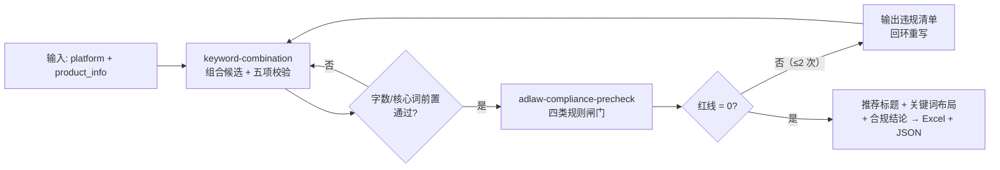

# 关键词挖掘与标题组合 Keyword Title Combo Flow

> 复合技能（工作流） ｜ 属于「Listing 文案师」 ｜ 电商小卖家客群 ｜ T3 编排型（脚本串联原子技能，ID `de_ecom_07_wf01`）
>
> **把类目词组合成标题候选，再强制过一次广告法闸门——红线为 0 的标题才允许交付。**
> 4 步链路 · 编排 2 个原子技能 · 五项逐条校验（字数/核心词前置/重复词/无关词/违禁词）· 回环上限 2 次 · 一次 ROI ≈ 月省文案 10h


*上图来自真实执行：淘宝保温杯 3 个标题候选端到端实跑——五项校验全过、广告法闸门红线 0、回环 0 次，一次通过交付 3 个可用标题，产物落盘 Excel + JSON。*

---

## 它做什么（闸门前置的标题流水线）

核心价值是**闸门前置**：标题在交付前已过一次《广告法》第九条级别扫描，避免「写完被平台驳回返工」。

### 步骤明细

| # | 步骤 | 原子技能 | 处理 | 失败处理 |
|---|---|---|---|---|
| 1 | 输入校验 | — | 校验 `platform` 与 `product_info` 非空 | 缺字段即中止，列缺失清单 |
| 2 | 标题组合与校验 | `keyword-combination` | 组合候选；五项校验 | 全部不合格 → 不进入第 3 步，直接返回修改建议 |
| 3 | 广告法闸门 | `adlaw-compliance-precheck` | 四类规则分级扫描 | 红线 > 0 → 回环重写，**最多 2 次** |
| 4 | 汇总交付 | — | 合并为交付清单 | 无可用标题 → 交付「无合规标题」并给原因 |

**回环上限 2 次**：超限判定商品素材本身不适合当前平台，提示换类目词或换平台，不强行交付。

## 真实输入 → 真实输出

**输入**（`examples/input.json` 关键字段）：

```json
{
  "platform": "淘宝",
  "core_word": "保温杯",
  "candidate_titles": ["保温杯 304不锈钢 500ml 办公室便携带茶隔", "…", "2026新款保温杯大容量办公室学生便携水杯不漏水焖烧杯"],
  "category_words_to_avoid": ["手机壳", "数据线"]
}
```

**输出**（脚本端到端实跑，节选）：

| # | 步骤 | 原子技能 | 状态 | 关键结果 |
|---|---|---|---|---|
| 2 | 标题组合与校验 | keyword-combination | ✅ | 可用 3 个；推荐「保温杯 304不锈钢 500ml 办公室便携带茶隔」 |
| 3 | 广告法闸门 | adlaw-compliance-precheck | ✅ | 红线 0 / 警告 0；回环 0 次 |
| 4 | 汇总交付 | — | ✅ | 交付 3 个可用标题；结论「通过」 |

| # | 可用标题 | 字数/上限 | 合规 |
|---|---|---|---|
| 1 | 保温杯 304不锈钢 500ml 办公室便携带茶隔 | 25/60 | ✅ |
| 2 | 带茶隔保温杯 大容量女款 500ml 304不锈钢 通勤车载 | 30/60 | ✅ |

完整结果见 [`examples/output.md`](examples/output.md)；产物 6 个真实文件：`out/流程执行报告.xlsx`、`out/flow_result.json`，及 `out/step2_keyword/`、`out/step3_adlaw/` 两个原子技能产物目录。

## 处理流水线（DAG，节点 = 真实技能 slug）



## 快速开始

**方式一：提示词编排（任意 AI 工具）**

```text
1. 打开 prompt.txt，全文复制
2. 粘贴到 Coze / WorkBuddy / Dify / Claude / ChatGPT
3. 按 schema.json 的输入规格提供：platform + product_info（可选 candidate_titles 只校验不生成）
```

**方式二：端到端脚本（零 AI 依赖）**

```bash
python scripts/run_flow.py --input examples/input.json --outdir out
```

## 该用 / 别用

| ✅ 该用 | ❌ 别用 |
|---|---|
| 上新前一步到位：标题生成 + 合规扫描一次跑完 | 写卖点、详情页文案（转 five-point-sellingpoint-flow） |
| 已有标题候选，只做「五项校验 + 合规闸门」 | 编造 KD、搜索量、竞品数据 |
| 违规标题自动回环重写（≤ 2 次） | 回环超限仍强行交付（应中止换词） |
| 跨平台复用（6 平台字数规则内置） | 100% 零人工（AI 输出必须人工复核后上架） |

## 边界与合规

- 本资产输出为 **AI 辅助生成内容**，发布前必须人工确认，并按平台要求完成 AI 内容标识
- 严格按步骤顺序执行，不跳过 S2 合规闸门直接交付；平台规则以官方最新公示为准
- 未授权品牌词不得写入标题；数值（字数、核心词位次、命中词）以脚本输出为准

## 文件地图

```text
├── README.md                ← 本文件
├── SKILL.md                 ← 资产定义（DAG / 步骤明细 / 契约）
├── prompt.txt               ← 提示词本体（步骤链路 + 回环规则 + 输出格式）
├── schema.json              ← 输入输出契约 + DAG 声明（机器可读）
├── scripts/run_flow.py      ← 端到端编排脚本（串联 2 个原子技能 → Excel/JSON）
├── examples/                ← 真实输入 + 端到端实跑输出
├── docs/                    ← 10 项配套文档（架构 / 流程 / 场景 / 测试报告…）
└── out/                     ← 实跑产物（流程执行报告.xlsx / flow_result.json / step2_* / step3_*）
```

---

*本资产遵循 [bangwozuo 数字员工资产规范](https://github.com/bangwozuo/digital-employee-spec) v3.0 ｜ [所属员工：Listing 文案师](../../) ｜ [总入口](https://github.com/bangwozuo/digital-employees-hub-zh)*
