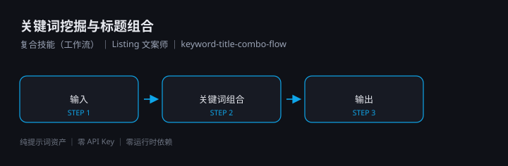

# 关键词挖掘与标题组合

> 复合技能（工作流） ｜ 属于「Listing 文案师」 ｜ 电商小卖家 客群 ｜ ID `de_ecom_07_wf01`

把商品的类目词组合成标题候选，再**强制过一次广告法闸门**，只有红线为 0 的标题才允许交付。



---

## 这是什么

一个 4 步工作流：输入校验 → 标题组合 → 广告法闸门 → 汇总交付，
编排 `keyword-combination` 与 `adlaw-compliance-precheck` 两个原子技能。
核心价值是**闸门前置**——标题在交付前已过一次《广告法》第九条级别扫描。

| 特性 | 说明 |
|------|------|
| 零 API Key | 不需要任何密钥 |
| 零部署 | 无需服务端；脚本用本机 Python 直接跑 |
| 平台无关 | Coze / WorkBuddy / Dify / Claude / ChatGPT 均可 |
| 用户自备算力 | 模型来自你自己的订阅 |

## 快速开始

**方式一 · 纯提示词编排**

```text
1. 打开 workflows/keyword-title-combo-flow/prompt.txt
2. 全文复制，粘贴到你的 AI 工具
3. 提供 platform + product_info（可选 candidate_titles）
```

**方式二 · 端到端脚本**

```bash
python scripts/run_flow.py --input examples/input.json --outdir out
```

产物：`out/流程执行报告.xlsx`、`out/flow_result.json`、`out/step2_keyword/`、`out/step3_adlaw/`

## 编排的原子技能

| # | 原子技能 | 角色 |
|---|---|---|
| 1 | [关键词组合](../../skills/keyword-combination/) | 主生产节点 |
| 2 | [广告法合规预审](../../skills/adlaw-compliance-precheck/) | 质量闸门（红线 > 0 回环，≤2 次） |

## 文件地图

```text
├── README.md                ← 本文件
├── SKILL.md                 ← 资产定义（DAG / 步骤明细 / 契约）
├── prompt.txt               ← 提示词本体
├── schema.json              ← 输入输出契约 + DAG 声明
├── scripts/                 ← 编排脚本（端到端跑通）
├── examples/                ← 示例输入与实跑输出
└── docs/                    ← 10 项配套文档
```

## 面向谁 / 解决什么

- **用户群体**：淘宝 / 抖店 / 拼多多 / 小红书店铺小卖家
- **解决痛点**：标题写完被平台驳回返工；违规词靠肉眼查不全
- **衡量指标**：上架一次通过率、标题字数合规率、CTR

详见 [使用示例](docs/04-examples.md) 与 [测试报告](docs/09-test-report.md)。

## 合规

- 本资产输出为 **AI 辅助生成内容**，发布前必须经人工审核
- 回环上限 2 次，超限即中止而**不交付**违规标题
- 请按所在平台要求完成 **AI 生成内容标识**

---

*本资产遵循 [bangwozuo 数字员工资产规范](https://github.com/bangwozuo/digital-employee-spec) v3.0*
