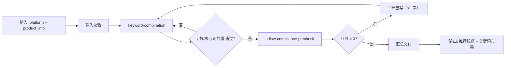

# 关键词挖掘与标题组合

把商品的类目词组合成标题候选，再**强制过一次广告法闸门**，
只有合规的标题才允许进入交付。

## 元信息

| 字段 | 值 |
|------|-----|
| ID | `de_ecom_07_wf01` |
| 类型 | **`composite`（复合技能）** |
| 所属员工 | Listing 文案师 |
| 阶段 | `P0` |
| 复杂度 | `S` |
| 触发方式 | 人工 |
| ROI | 月省文案 10h≈¥300 |
| 资产形态 | 纯提示词 + 可选 Python 编排脚本（离线、无 API Key） |

## 能力描述

关键词挖掘与标题组合是一个复合技能，按业务顺序编排 2 个原子技能，
完成「类目词 → 标题候选 → 合规闸门 → 可用标题」的完整流程。
核心价值在于**闸门前置**：标题在交付前已经过一次《广告法》第九条级别的扫描，
避免「写完再被平台驳回」的返工。

## 编排的原子技能

| # | 原子技能 | 能力 | 在本流程中的角色 |
|---|---------|------|-----------------|
| 1 | [keyword-combination](../../skills/keyword-combination/) | 标题组合 + 五项校验 | 主生产节点 |
| 2 | [adlaw-compliance-precheck](../../skills/adlaw-compliance-precheck/) | 广告法四类规则分级扫描 | 质量闸门（红线 > 0 回环） |

## 步骤链路（DAG）



## 步骤明细

| # | 步骤 | 技能资产 | 输入 | 输出 | 失败处理 |
|---|------|---------|------|------|---------|
| 1 | 输入校验 | — | `platform` + `product_info` | 规范化 payload | 缺字段即中止，列出缺失清单 |
| 2 | 标题组合与校验 | `../../skills/keyword-combination/` | 第 1 步输出 + `keywords` | 可用标题候选 + 关键词布局 | 全部候选不合格 → 不进入第 3 步，返回修改建议 |
| 3 | 广告法闸门 | `../../skills/adlaw-compliance-precheck/` | 第 2 步可用标题拼接文本 | 违规清单 + 总体结论 | 红线 > 0 → 回环到第 2 步重写，最多 2 次；超限则中止 |
| 4 | 汇总交付 | — | 第 2/3 步产物 | 交付清单（标题 + 布局 + 合规结论） | 无可用标题 → 交付「无合规标题」并说明原因 |

## 输入规格

| 字段 | 类型 | 必填 | 说明 |
|------|------|------|------|
| `platform` | string | ✅ | 淘宝 / 天猫 / 抖音 / 拼多多 / 小红书 / Amazon |
| `product_info` | object | ✅ | 商品信息（品名、材质、规格、卖点、场景） |
| `core_word` | string | ⬜ | 核心词；缺省取 `keywords` 中「核心词」层级 |
| `keywords` | array | ⬜ | 关键词及层级（核心词 / 长尾词 / 蓝海词 / 场景词） |
| `candidate_titles` | array | ⬜ | 待校验的标题候选；提供则只校验不生成 |
| `category_words_to_avoid` | array | ⬜ | 不得出现的无关类目词 |

## 输出规格

| 字段 | 类型 | 说明 |
|------|------|------|
| `steps` | array | 每步状态与关键结果 |
| `deliverable` | object | 可用标题 + 合规结论 + 回环次数 |
| `summary` | object | 执行结论与可用标题数 |

## 使用步骤

### 方式一：纯提示词编排（最快）

1. 打开任意 AI 工具，把 `prompt.txt` **全文**粘贴为系统提示词
2. 提供 `platform` + `product_info`（可选 `keywords`）
3. 模型按 DAG 依次执行两个原子技能并汇总

### 方式二：带脚本端到端跑（产出流程执行报告）

```bash
python3 <FLOW_DIR>/scripts/run_flow.py --input input.json --outdir out
python3 <FLOW_DIR>/scripts/run_flow.py --demo      # 无输入也能看效果
```

产物：

| 文件 | 内容 |
|---|---|
| `out/流程执行报告.xlsx` | 步骤明细 / 最终交付 / 汇总 |
| `out/flow_result.json` | 机器可读结果 |
| `out/step2_keyword/`、`out/step3_adlaw/` | 各步原子技能的真实产物 |

## 错误处理

| 情况 | 处理方式 |
|------|---------|
| 输入缺失（`platform`/`product_info`） | 列出缺失字段，**中止流程**，不进入 S1 |
| S1 无可用候选 | 跳过 S2 闸门，返回修改建议（不强行交付） |
| S2 有红线 | 回环到 S1 重写；**最多 2 次**，超限则中止并说明 |
| 原子技能脚本缺失 | 抛 `FileNotFoundError` 并中止，提示检查 `skills/` 目录 |
| 提示词被平台截断 | 拆分任务，分两次处理 |

## 验收标准

- [ ] 每一步引用的原子技能在同仓 `skills/` 下真实存在
- [ ] 步骤间输入输出字段可衔接（`keyword_check.json` → `adlaw_scan.json`）
- [ ] 末步输出带 AI 生成标识
- [ ] 全流程保留人工确认环节
- [ ] 红线 > 0 时不交付标题（闸门生效）

## 调用示例

**输入**（`examples/input.json`）：淘宝保温杯，3 个标题候选。

**输出**（脚本实跑）：

| # | 步骤 | 状态 | 关键结果 |
|---|---|---|---|
| 1 | 输入校验 | ✅ | payload 完整 |
| 2 | keyword-combination | ✅ | 可用 3 个；推荐「保温杯 304不锈钢 500ml 办公室便携带茶隔」 |
| 3 | adlaw-compliance-precheck | ✅ | 红线 0 / 警告 0；回环 0 次 |
| 4 | 汇总交付 | ✅ | 结论「通过」 |

## 所属工作流

本资产为复合技能（工作流），是独立的端到端流程，不隶属于其他工作流。

## 合规声明

- 本技能输出为 **AI 辅助生成内容**，发布前必须经人工审核
- 平台字数上限与审核规则以官方最新公示为准
- 未授权品牌词不得写入标题；请按平台要求完成 AI 生成内容标识

---

*本复合技能由深度改造生成 · 2026-09-30*
