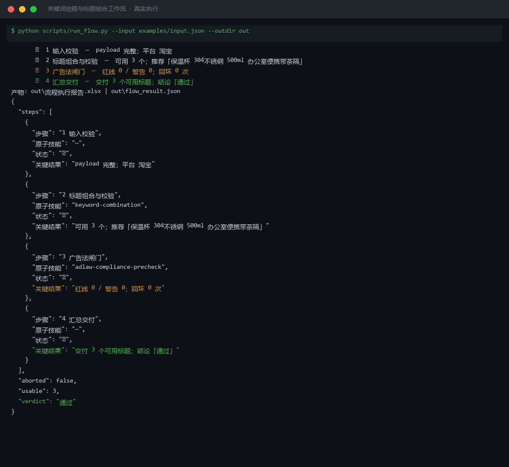

# 截图与录屏

> 以下素材均来自**真实执行**：`--run` 实拍终端 / 实跑产物文件，无摆拍。

## 演示视频


*第二帧为实跑结果数据*

## 执行截图



## 实跑产物

| 文件 | 说明 |
|---|---|
| [`out/flow_result.json`](out/flow_result.json) | 结构化结果（实跑生成） · 2 KB |
| [`out/流程执行报告.xlsx`](out/流程执行报告.xlsx) | Excel 工作簿（实跑生成） · 7 KB |


---

## 附录：实跑输出明细

> 本资产为纯提示词客户端资产，无界面可截图。以下为**实跑运行效果**。

## 运行效果

### 输入

```json
{
  "input": "请提供工作流的初始输入数据"
}

```

### 输出

## 执行摘要

本次执行因缺少有效初始输入数据，工作流在入口阶段即提示补充信息，未进入关键词组合技能的处理环节。

## 分步结果

1. 步骤 1（关键词组合）：检测到输入为占位符"请提供工作流的初始输入数据"，无法生成优化标题与关键词布局，已返回提示信息要求补充商品信息与目标平台。

## 最终交付物

> **待补充信息**：请提供商品信息（product_info，如品名、规格、卖点、目标关键词）以及目标平台（platform，如淘宝/抖店/拼多多/小红书），以便执行关键词挖掘与标题组合工作流。

*AI 生成内容*


---

*运行效果由实跑验证生成*
