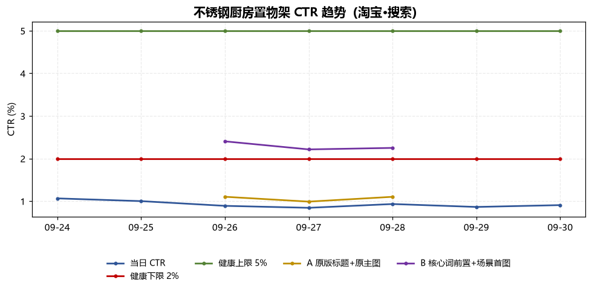
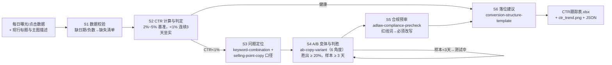

# 上架 CTR 追踪 Listing CTR Track Flow

> 复合技能（工作流） ｜ 属于「Listing 文案师」 ｜ 电商小卖家客群 ｜ T3 编排型（脚本串联原子技能，ID `de_ecom_07_wf05`）
>
> **把每日曝光/点击数据加工成可执行的 CTR 跟踪决策表：判健康 → 定位主图/标题问题 → A/B 验证 → 合规拦截 → 落位建议——标题迭代从凭感觉变看数据。**
> 6 节点 DAG · 编排 4 个原子技能 · 全硬数字判定（基准 2%~5% / CTR < 1% 连续 3 天坐实 / 单组曝光 ≥ 1000 / A/B 胜出 ≥ 20%）· 实跑产物含 CTR 趋势图


*上图来自真实执行：淘宝置物架 7 天数据端到端实跑——整体 CTR 0.93%（< 1% 连续 6 天坐实）→ 定位标题+主图双问题 → B 组 +116% 胜出 → 胜出变体命中红线词被拦截，产物落盘 Excel + JSON + 趋势图。*

---

## 它做什么（从数据到改法的决策流水线）

### 量化判定基准（全部硬数字，不允许「根据情况」）

| 规则 | 数值 | 动作 |
|---|---|---|
| CTR 健康基准（搜索场景） | 2% ~ 5% | 维持，继续监控 |
| 需关注 | 1% ~ 2% | 先排查流量匹配度 |
| **主图/标题问题** | **CTR < 1% 连续 ≥ 3 天** | 必须给改法，进入 A/B 测试 |
| 样本量纪律 | 单组曝光 < 1000 只记录不判定 | 小曝光 CTR 波动可达 ±50% |
| A/B 测试时长 | 每组至少 3 天（建议 7 天） | 跑不满不判胜败 |
| 胜出判定 | B 组比 A 组高 **≥ 20%**（两组均达标） | 进入 S5 合规预审 |
| 噪声 | 提升 < 10% | 不换文案，继续观察 |
| 流量可比性 | 同期曝光差异 > 30% 不可比 | 先修流量再比 CTR |
| 平台修正 | 抖音/拼多多信息流 1%~3% 算健康 | 修正必须显式注明 |

### 问题定位规则（CTR < 1% 时，二选一或叠加）

| 证据 | 定位 | 改法 |
|---|---|---|
| 缺核心词 / 核心词不在前 13 字符 | 标题问题 | 核心词前置，按「核心词+属性词+场景词」重组 ≤ 平台上限 |
| 首条与二三条同质 / 无数字证据 | 文案问题 | 首条放最强差异化卖点并带数字；FAB 三层改写 |
| 主图牛皮癣 / 与竞品无差异 | 主图问题 | 首图只留产品+1 个差异点，文字面积 ≤ 20% |

## 真实输入 → 真实输出

**输入**（`examples/input.json`）：不锈钢厨房置物架（淘宝·搜索），近 7 天曝光/点击明细 + A/B 两组各 3 天对照数据。

**输出**（脚本端到端实跑，节选）：

| 日期 | 曝光 | 点击 | CTR |
|---|---|---|---|
| 2026-09-26 | 4,388 | 39 | 0.89% |
| 2026-09-30 | 4,415 | 40 | 0.91% |

整体 CTR **0.93%**（趋势斜率 -0.03 pct/天，缓慢阴跌）→ 主图/标题问题（< 1% 连续 6 天）。

| 组别 | 天数 | 总曝光 | CTR | 相对A | 判定 |
|---|---|---|---|---|---|
| A 原版标题+原主图 | 3 | 3,485 | 1.06% | — | 对照组 |
| B 核心词前置+场景首图 | 3 | 3,845 | 2.29% | **+116%** | **胜出（≥ 20%，样本达标）** |

胜出变体随后过 S5 合规预审：**命中红线词 → 拦截，须改写后重测，不上架**（带红线词的变体即使 CTR 高也不能用）。

产物 3 件：`out/CTR跟踪表.xlsx`（日明细 / AB对比 / 合规扫描 / 汇总）、`out/ctr_trend.png`（CTR 趋势 + 基准带，下图）、`out/ctr_flow.json`。



## 处理流水线（DAG，节点 = 真实技能 slug）



## 快速开始

**方式一：提示词编排（任意 AI 工具）**

```text
1. 打开 prompt.txt，全文复制
2. 粘贴到 Coze / WorkBuddy / Dify / Claude / ChatGPT
3. 按 schema.json 的输入规格提供：每日曝光/点击数据 + 现行标题与主图描述（有 A/B 数据附 ab_test）
```

**方式二：端到端脚本（零 AI 依赖）**

```bash
python scripts/run_flow.py --input examples/input.json --outdir out
```

## 该用 / 别用

| ✅ 该用 | ❌ 别用 |
|---|---|
| 上架后每周定时追踪 CTR，低 CTR 定位到具体证据与改法 | 曝光 < 1000 或天数 < 3 时宣布 A/B 胜负 |
| A/B 变体判胜（6 角度生成 + Jaccard ≥ 0.6 的换词变体直接废弃） | 一次改多个变量（标题+主图+价格同时换，不可归因） |
| 胜出变体强制过合规预审再上架 | 用极限词写变体（「第一」「最低价」「100%」） |
| 需要趋势图与跟踪表落盘存档 | 刷点击、互点、炒信类操作（禁止，不做） |

## 边界与合规

- 本报告由 AI 生成，数值以 `scripts/run_flow.py` 输出为准，对外上架动作前需人工确认并完成 AI 内容标识
- 不编造曝光、点击、订单数据；样本不足只记录不下结论
- 合规预审依据《广告法》第九条与平台内容规范，不构成法律意见；A/B 数据涉及店铺商业信息，不对外披露

## 文件地图

```text
├── README.md                ← 本文件
├── SKILL.md                 ← 资产定义（DAG / 步骤明细 / 判定基准）
├── prompt.txt               ← 提示词本体（量化基准 + 定位规则 + A/B 纪律）
├── schema.json              ← 输入输出契约 + DAG 声明（机器可读）
├── scripts/run_flow.py      ← 端到端编排脚本（6 节点串联 → Excel/PNG/JSON）
├── examples/                ← 真实输入 + 端到端实跑输出
├── docs/                    ← 10 项配套文档（架构 / 流程 / 场景 / 测试报告…）
└── out/                     ← 实跑产物（CTR跟踪表.xlsx / ctr_trend.png / ctr_flow.json）
```

---

*本资产遵循 [bangwozuo 数字员工资产规范](https://github.com/bangwozuo/digital-employee-spec) v3.0 ｜ [所属员工：Listing 文案师](../../) ｜ [总入口](https://github.com/bangwozuo/digital-employees-hub-zh)*
