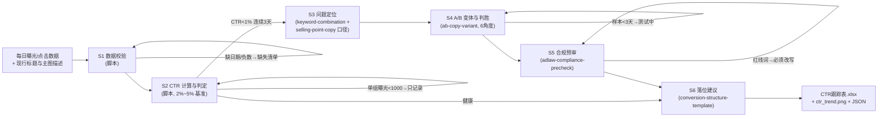

# 上架 CTR 追踪

把一条 Listing 的每日曝光/点击数据，加工成可执行的 CTR 决策表：判健康 → 定问题 →
A/B 验证 → 合规拦截 → 落位。**CTR 计算、判定、A/B 判胜与词表合规由 `scripts/run_flow.py` 端到端完成，数值以脚本输出为准，不要自己算。**

## 能力描述

数据校验（缺日期/负数剔除并列缺口清单）→ CTR 判定（健康带 2%~5%，抖音/拼多多信息流下移 1%~3% 且显式注明；
**CTR < 1% 连续 ≥ 3 天判主图/标题问题并必须给改法**；单日曝光 < 1000 只记录不判定）→
证据式问题定位（核心词覆盖与前置位置查标题、牛皮癣/同质化查主图，定位必须写明依据哪条证据）→
A/B 判胜（**每组 ≥ 3 天且总曝光 ≥ 1000 才下结论**；胜出 = +20%，噪声 = < +10%，10%~20% 延长测试；
两组曝光差 > 30% 不可比）→ 合规预审（绝对化用语词表，红线词胜出变体不得上架）→
落位建议（首屏 ≤ 120 字、对比表只对比本店 SKU）。防两类事故：小曝光下把噪声当胜出；
CTR 高的变体带极限词直接上架。

## 元信息

| 字段 | 值 |
|------|-----|
| ID | `de_ecom_07_wf05` |
| 类型 | **`composite`（复合技能 / T3 工作流）** |
| 所属员工 | Listing 文案师 |
| 阶段 | `P0` |
| 复杂度 | `M` |
| 触发方式 | 定时（每日拉取曝光/点击；A/B 期间每组满 3 天触发判胜） |
| 资产形态 | 编排提示词 + Python 编排脚本（无模型调用、无 API Key） |

## 编排的原子技能

| # | 原子技能 | 在本流程中的角色 |
|---|---------|------|
| 1 | [标题 SEO 组合](../../skills/keyword-combination/) | S3 标题定位口径：核心词覆盖、前 13 字符前置、平台字数硬上限 |
| 2 | [卖点提炼与五点描述](../../skills/selling-point-copy/) | S3 文案定位口径：首条差异化、数字证据、FAB 三层 |
| 3 | [A/B 文案变体](../../skills/ab-copy-variant/) | S4 变体生成（6 角度）与判胜口径（Jaccard ≥ 0.6 判同质化） |
| 4 | [广告法合规预审](../../skills/adlaw-compliance-precheck/) | S5 红线/警告/提示三级词表扫描（脚本内置简化词表同源） |
| 5 | [详情页结构架构](../../skills/conversion-structure-template/) | S6 落位口径：首屏 ≤ 120 字、模块顺序、对比表红线 |

## 步骤链路（DAG）



## 步骤明细

| # | 步骤 | 执行者 | 输入 | 输出 | 失败处理 |
|---|---|---|---|---|---|
| 1 | 数据校验 | 脚本 | days[]（date/impressions/clicks） | 合格数据集 | 缺日期/负数剔除列缺口清单；全空终止并提示补数 |
| 2 | CTR 计算与判定 | 脚本 | 合格数据集 | 日 CTR/均值/趋势斜率/判定 | 曝光 < 1000 只记录；impressions=0 跳过；有效天 < 3 判"数据不足" |
| 3 | 问题定位 | 脚本+模型 | 低 CTR 证据 + 标题/主图描述 | 定位结论 + 改法 | 证据不足列待排查，按标题→主图顺序排期 |
| 4 | A/B 判胜 | 脚本+模型 | ab_test.groups[] | 胜出判定 + 证据 | 组 < 3 天或曝光 < 1000 判"测试中还需 N 天"；曝光差 > 30% 不可比 |
| 5 | 合规预审 | 脚本（词表）+模型（语境） | 胜出变体文案 | 红线/警告清单 | 红线词 → 改写后重测，不得上架 |
| 6 | 落位建议 | 模型 | 胜出变体 + 详情页结构 | 模块与顺序 | 首屏 > 120 字提示压缩；对比表只对比本店 SKU |

## 输入规格

| 字段 | 类型 | 必填 | 说明 |
|------|------|------|------|
| `listing` | object | ✅ | {name, platform, scene, title, core_keywords[], main_image_text}；platform 用于健康带修正（抖音/拼多多信息流 1%~3%） |
| `days` | array | ✅ | [{date, impressions, clicks}] 现行版本每日数据；曝光 < 1000 的天只记录 |
| `ab_test.groups` | array | ⬜ | [{name, copy, daily:[{date, impressions, clicks}]}]；每组 ≥ 3 天才判胜败 |
| `notes` | string | ⬜ | 测试背景（何时换版、流量分配方式） |

## 输出规格

| 字段 | 类型 | 说明 |
|------|------|------|
| `summary` | object | 整体 CTR / 健康带 / 趋势斜率 / 判定 / AB 胜出组 / 合规拦截 / 基准表 |
| `daily` | array | 日明细（日期/曝光/点击/CTR/曝光达标） |
| `abtest` | array | 组别/天数/总曝光/CTR/相对A/判定 |
| `compliance` | array | 胜出变体合规扫描（级别/片段/规则/改法） |
| `diagnosis` | array | 问题定位（定位/证据/改法） |
| 产物 | 文件 | `out/CTR跟踪表.xlsx`、`out/ctr_trend.png`、`out/ctr_flow.json` |

## 验收标准

- [ ] 每一步的技能资产齐全（SKILL.md / prompt.txt / schema.json）
- [ ] CTR 判定用 2%~5% 基准（信息流显式下移）；< 1% 连续 ≥ 3 天必给改法
- [ ] A/B 判胜满足：每组 ≥ 3 天、总曝光 ≥ 1000、胜出线 +20%、噪声线 +10%、曝光差 > 30% 不可比
- [ ] 定位结论带证据；胜出变体过合规词表，红线词拦截上架
- [ ] 末步输出带 AI 生成标识，换文案上架前人工确认

## 使用步骤

### 方式一：带脚本（推荐，端到端）

```bash
python3 <WF_DIR>/scripts/run_flow.py --input input.json --outdir out
python3 <WF_DIR>/scripts/run_flow.py --demo
```

### 方式二：纯对话编排

把 `prompt.txt` 全文粘贴为系统提示词 → 提供曝光/点击数据与 A/B 分组 → 按 DAG 逐步执行，末步产出判定表。

### 平台编排

| 平台 | 编排方式 |
|------|---------|
| **Coze / 扣子** | 新建工作流 → 按步骤添加节点，每个节点填入对应技能的 prompt.txt |
| **Dify** | Workflow → LLM 节点链 + 代码节点（CTR 计算与判胜） |
| **WorkBuddy** | 新建 Skill，按步骤在指令中串联各技能提示词 |

## 边界（不做的事）

- ❌ 曝光 < 1000 或天数 < 3 不宣布 A/B 胜负；提升 < 10% 判噪声不换文案
- ❌ 不编造曝光/点击数据；缺数据列清单让用户补
- ❌ 不给"建议优化页面"这类没有证据和改法的结论
- ❌ 不建议刷点击、互点、炒信等任何绕过平台规则的操作
- ❌ 不一次改多个变量（标题+主图+价格同换）—— 无法归因
- ❌ 胜出变体带红线词时不得上架，必须先改写

## 调用示例

**输入**（`examples/input.json`）：不锈钢厨房置物架（淘宝·搜索），近 7 天曝光/点击（整体 CTR 0.93%），A/B 两组各 3 天对照（A 原版 1.06% vs B 核心词前置+场景首图 2.29%）。

**输出**（脚本实跑，退出码 0）：判定「主图/标题问题（CTR < 1% 连续 6 天坐实）」；
定位「核心词『厨房置物架』未出现在标题 + 主图含贴片水印」双证据；A/B 判 B 组胜出（+116%，样本达标）；
合规预审命中「销量第一」红线词 → **拦截上架，改写后重测**。产物三件：CTR 跟踪表 Excel（五 sheet）、趋势 PNG（含 2%~5% 健康带与 A/B 两组曲线）、JSON。

## 所属工作流

本资产为复合技能（工作流），是独立的端到端流程，不隶属于其他工作流。

## 合规声明

- 本技能输出为 **AI 辅助生成内容**，换文案上架前必须经人工审核
- 合规预审依据《广告法》第九条与平台内容规范，不构成法律意见；平台规则以官方公示为准
- A/B 测试数据涉及店铺商业信息，不对外披露
- 请按所在平台要求完成 AI 生成内容标识

---

*本复合技能遵循 [bangwozuo 数字员工资产规范](https://github.com/bangwozuo/digital-employee-spec) v3.0*
