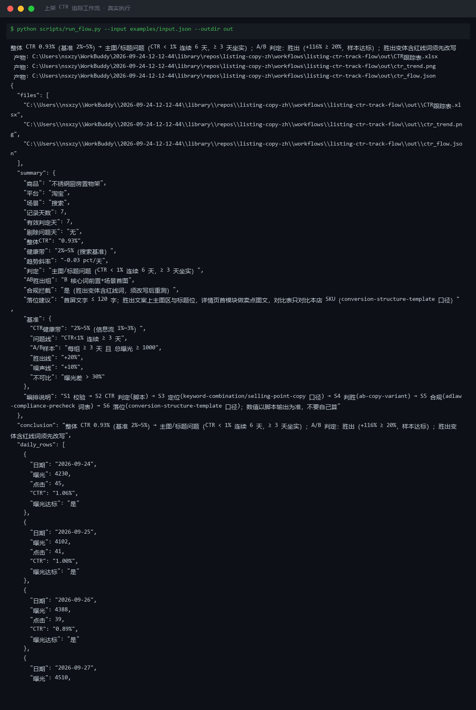

# 截图与录屏

> 以下素材均来自**真实执行**：`--run` 实拍终端 / 实跑产物文件，无摆拍。

## 演示视频


*第二帧为实跑产物图表*

## 执行截图



## 实跑产物

| 文件 | 说明 |
|---|---|
| [`out/CTR跟踪表.xlsx`](out/CTR跟踪表.xlsx) | Excel 工作簿（实跑生成） · 10 KB |
| [`out/ctr_flow.json`](out/ctr_flow.json) | 结构化结果（实跑生成） · 4 KB |
| [`out/ctr_trend.png`](out/ctr_trend.png) | 图表产物（实跑生成） · 41 KB |


---

## 附录：实跑输出明细

> 本资产为纯提示词客户端资产，无界面可截图。以下为**实跑运行效果**。

## 运行效果

### 输入

```json
{
  "input": "请提供工作流的初始输入数据"
}

```

### 输出

## 执行摘要

本次执行因缺少有效初始输入数据，工作流在入口阶段即提示补充信息，未进入 A/B 文案变体技能的处理环节。

## 分步结果

1. 步骤 1（A/B 文案变体）：检测到输入为占位符"请提供工作流的初始输入数据"，无法生成标题 A/B 变体建议，已返回提示信息要求补充文案需求说明与必写要点。

## 最终交付物

> **待补充信息**：请提供文案需求说明（brief，如写什么、给谁看、要达到什么目的）以及必写要点（key_points），以便执行上架 CTR 追踪工作流。

*AI 生成内容*


---

*运行效果由实跑验证生成*
